scNano: Pagoda2 & Conos Quick Walkthrough
================

-   [Preliminary](#preliminary)
-   [Loading the data](#loading-the-data)
    -   [Running pagoda2 processing](#running-pagoda2-processing)
-   [Conos integration](#conos-integration)
    -   [Pre-processing with Pagoda2](#pre-processing-with-pagoda2)
    -   [Pre-processing with Seurat](#pre-processing-with-seurat)
-   [Integrating datasets with Conos](#integrating-datasets-with-conos)
-   [Exploring hierarchical community structure](#exploring-hierarchical-community-structure)
-   [Label propagation](#label-propagation)

In this tutorial we will go over the analysis of a panel of samples using Pagoda2 and Conos.

[Pagoda2](https://github.com/hms-dbmi/pagoda2) is a package aimed at analysis of standalone datasets. It performs basic tasks such as cell size normalization, gene variance normalization, and can be used to idetnify subpopulations and run differential expression within idividual samples.

[Conos](https://github.com/hms-dbmi/conos) is a package for joint analysis of multiple datasets. Conos objects can be used to identify clusters of corresponding cells across panels of samples from similar or dissimilar sources, with different degrees of cell type overlap. Here we will identify corresponding clusters accorss a panel of bone marrow (BM) and cord blood (CB) by generating a joint graph with the cells from all the samples. We will use the graph to propagate labels from a single labelled sample to other samples and finally perform differential expression between BM and CM samples.

Preliminary
===========

Let's load conos library to start with:

``` r
library(pagoda2)
```

    ## Loading required package: Matrix

    ## Loading required package: igraph

    ## 
    ## Attaching package: 'igraph'

    ## The following objects are masked from 'package:stats':
    ## 
    ##     decompose, spectrum

    ## The following object is masked from 'package:base':
    ## 
    ##     union

    ## 

    ## Warning: replacing previous import 'igraph::%>%' by 'magrittr::%>%' when
    ## loading 'pagoda2'

``` r
library(Matrix)
```

Loading the data
================

Next we will load a previously prepared panel of samples. This panel was made up of 16 cord blood and bone marrow samples, but here we look at a smaller subset of just 4 samples. All samples have been subset to exactly 3000 cells. Note: when starting with your own panel, it's recommended to filter out low-count / poor /dying cells.

``` r
panel <- readRDS(file.path(find.package('conos'),'extdata','panel.rds'))
```

Let's take a look at the panel. The panel is a named list of sparse matrices (type dgCMatrix).

``` r
str(panel,1)
```

    ## List of 4
    ##  $ MantonBM1_HiSeq_1:Formal class 'dgCMatrix' [package "Matrix"] with 6 slots
    ##  $ MantonBM2_HiSeq_1:Formal class 'dgCMatrix' [package "Matrix"] with 6 slots
    ##  $ MantonCB1_HiSeq_1:Formal class 'dgCMatrix' [package "Matrix"] with 6 slots
    ##  $ MantonCB2_HiSeq_1:Formal class 'dgCMatrix' [package "Matrix"] with 6 slots

Before we continue it is very important to make sure that cells in our panel are uniquely named. No two cells (even in different samples) should be named identically. In this case the cells have been prefixed by sample id, so there will not be any collisions. However in most cases you will have to prefix the cells before continuing.

``` r
head(colnames(panel[[1]]))
```

    ## [1] "MantonBM1_HiSeq_1-TCTATTGGTCTCTCGT-1"
    ## [2] "MantonBM1_HiSeq_1-GAATAAGTCACGCATA-1"
    ## [3] "MantonBM1_HiSeq_1-ACACCGGTCTAACTTC-1"
    ## [4] "MantonBM1_HiSeq_1-TCATTTGGTACGCTGC-1"
    ## [5] "MantonBM1_HiSeq_1-TATTACCCAAAGGAAG-1"
    ## [6] "MantonBM1_HiSeq_1-CGCCAAGCATCTGGTA-1"

To quickly check that the cell names will be unique, we can run:

``` r
any(duplicated(unlist(lapply(panel,colnames))))
```

    ## [1] FALSE

Let's take the first dataset and analyze it using Pagoda2.

``` r
cm <- panel[[1]]
str(cm)
```

    ## Formal class 'dgCMatrix' [package "Matrix"] with 6 slots
    ##   ..@ i       : int [1:2613488] 33 45 72 153 353 406 436 440 457 484 ...
    ##   ..@ p       : int [1:3001] 0 864 1701 2607 3256 3856 4537 5271 6030 7002 ...
    ##   ..@ Dim     : int [1:2] 33694 3000
    ##   ..@ Dimnames:List of 2
    ##   .. ..$ : chr [1:33694(1d)] "RP11-34P13.3" "FAM138A" "OR4F5" "RP11-34P13.7" ...
    ##   .. ..$ : chr [1:3000(1d)] "MantonBM1_HiSeq_1-TCTATTGGTCTCTCGT-1" "MantonBM1_HiSeq_1-GAATAAGTCACGCATA-1" "MantonBM1_HiSeq_1-ACACCGGTCTAACTTC-1" "MantonBM1_HiSeq_1-TCATTTGGTACGCTGC-1" ...
    ##   ..@ x       : num [1:2613488] 1 1 1 9 1 3 1 2 2 20 ...
    ##   ..@ factors : list()

The data structure stores molecule count matrix in a sparse format.

We will run through the main steps of pagoda2 processing, just to illustrate everything. First, let's take a look at the distribution of the number of molecules per cell, and per gene:

``` r
par(mfrow=c(1,2), mar = c(3.5,3.5,2.0,0.5), mgp = c(2,0.65,0), cex = 1.0)
hist(log10(colSums(cm)+1),main='molecules per cell',col='cornsilk',xlab='log10(molecules per cell)')
hist(log10(rowSums(cm)+1),main='molecules per gene',col='cornsilk',xlab='log10(molecules per gene])')
```

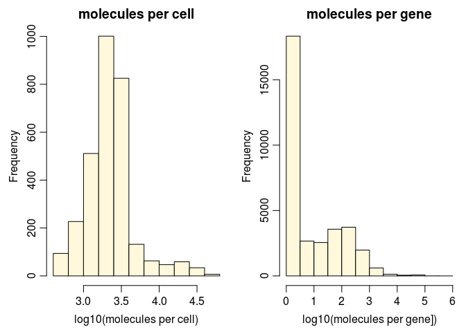

There's also a quick helper function to examine and filter cells based on the relationship between the number of molecules and the number of genes detected:

``` r
counts <- gene.vs.molecule.cell.filter(cm,min.cell.size=500)
```

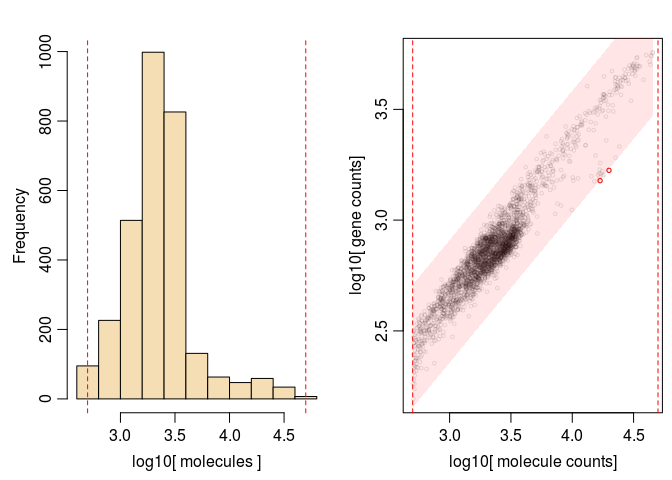

Next thing we want to do is to find lowly expressed genes and remove them from the dataset. Subsequent pagoda processing will do this automatically for extremely lowly expressed genes anyway.

``` r
hist(log10(rowSums(counts)+1),main='Molecules per gene',xlab='molecules (log10)',col='cornsilk')
abline(v=1,lty=2,col=2)
```

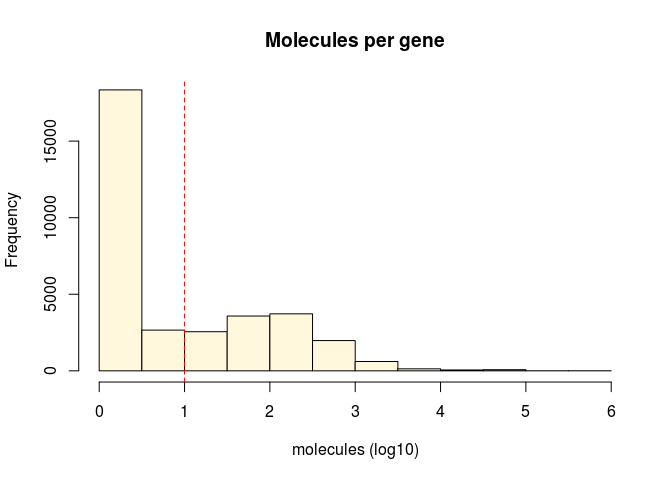

Let's filter and check the size of the resulting matrix:

``` r
counts <- counts[rowSums(counts)>=10,]
dim(counts)
```

    ## [1] 12693  2998

Running pagoda2 processing
--------------------------

First we will generate a pagoda object that will contain all our results. Our input matrix contains duplicated gene names (usually originating from different transcripts in the counting process). Check that you have the matrix in the correct orientation and that number of cells you are getting here is what you expect (like we do here). The input matrix must be in the genes x cells configuration.

``` r
rownames(counts) <- make.unique(rownames(counts))
r <- Pagoda2$new(counts,log.scale=TRUE, n.cores=2)
```

    ## 2998 cells, 12693 genes; normalizing ... using plain model log scale ... done.

Also note the n.cores parameter. Change this value to match the number of CPU cores on your system.

Next, we’ll adjust the variance, to normalize the extent to which genes with (very) different expression magnitudes will contribute to the downstream anlaysis:

``` r
r$adjustVariance(plot=T,gam.k=10)
```

    ## calculating variance fit ... using gam 186 overdispersed genes ... 186 persisting ...

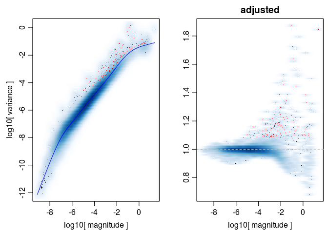

    ## done.

There are many alternative ways of proceeding with the downstream analysis. Below we’ll use the simplest, default scenario, where we first reduce the dataset dimensions by running PCA, and then move into k-nearest neighbor graph space for clustering and visualization calculations. First, the PCA reduction. Depending on the complexity of the dataset you are analysing you may want to adjust he nPcs parameter.

``` r
r$calculatePcaReduction(nPcs=50,n.odgenes=3e3)
```

    ## running PCA using 3000 OD genes .... done

Next we will generate a KNN graph of cells that will allow us to identify clusters of cells.

``` r
r$makeKnnGraph(k=40,type='PCA',center=T,distance='cosine');
```

Next on the basis of this KNN we will call clusters

``` r
require(igraph)
r$getKnnClusters(method=infomap.community,type='PCA')
```

Next we generate a 2 dimensional embedding of the data for visualization purposes with largeVis. LargeVis is much faster that the tSNE often used in single-cell analysis.

``` r
M <- 30; r$getEmbedding(type='PCA',embeddingType = 'largeVis', M=M,perplexity=30,gamma=1/M,alpha=1)
```

    ## Estimating embeddings.

and we plot the data:

``` r
r$plotEmbedding(type='PCA',show.legend=F,mark.clusters=T,min.group.size=50,shuffle.colors=F,mark.cluster.cex=1,alpha=0.1,main='clusters (largeVis)')
```

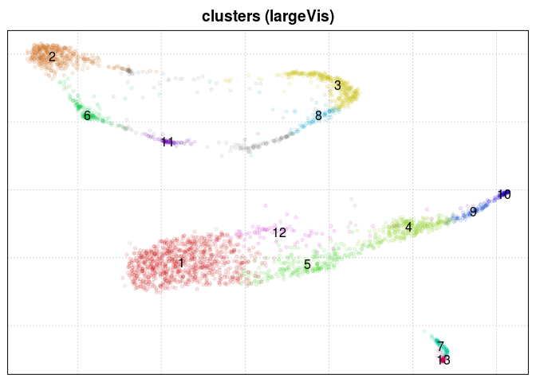

Next we can generate and plot a tSNE embedding. This can take a while to run!

``` r
r$getEmbedding(type='PCA',embeddingType='tSNE',perplexity=50,verbose=F,n.cores=30)
```

    ## calculating distance ... pearson ...running tSNE using 30 cores:

Plot the new tSNE embedding:

``` r
r$plotEmbedding(type='PCA',embeddingType='tSNE',show.legend=F,mark.clusters=T,min.group.size=1,shuffle.colors=F,mark.cluster.cex=1,alpha=0.1,main='clusters (tSNE)')
```

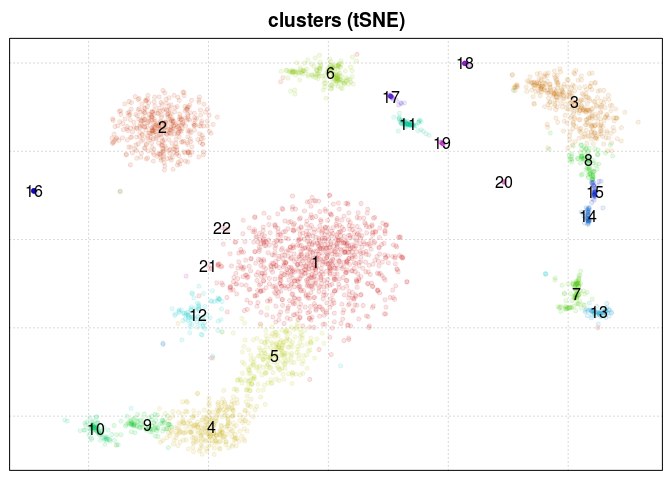

Visualize expression of a particular gene:

``` r
gene <-"HBB"
r$plotEmbedding(type='PCA',embeddingType='tSNE',colors=r$counts[,gene],shuffle.colors=F,mark.cluster.cex=1,alpha=0.1,main=gene)
```

    ## treating colors as a gradient with zlim: 0 1.61161

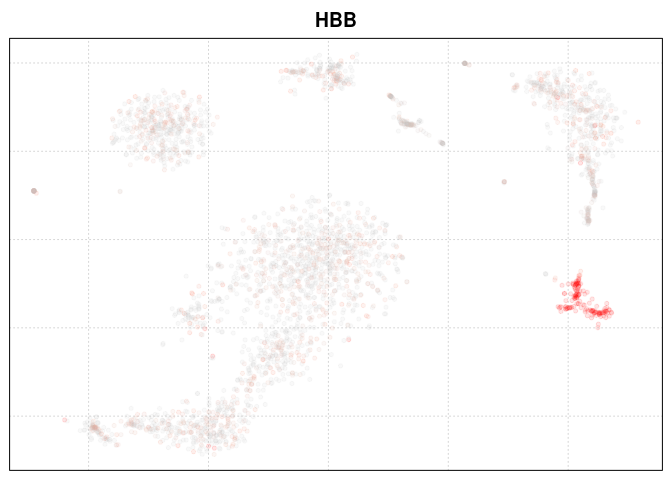

We can then perform differential expression between clusters:

``` r
r$getDifferentialGenes(type='PCA',verbose=T,clusterType='community')
```

    ## running differential expression with  22  clusters ... adjusting p-values ... done.

and visualise the top markers of a specific cluster

``` r
de <- r$diffgenes$PCA[[1]][['2']];
r$plotGeneHeatmap(genes=rownames(de)[1:15],groups=r$clusters$PCA[[1]])
```

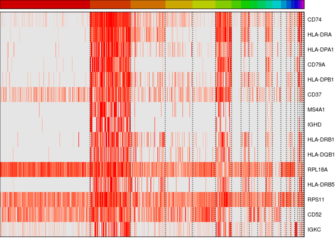

visual check:

``` r
gene <-"CD74"
r$plotEmbedding(type='PCA',embeddingType='tSNE',colors=r$counts[,gene],shuffle.colors=F,mark.cluster.cex=1,alpha=0.1,main=gene)
```

    ## treating colors as a gradient with zlim: 0 2.43135

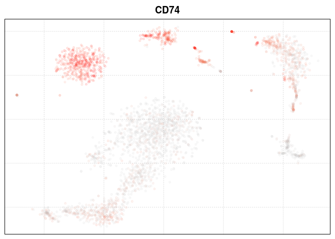

Finally, we can build an interactive application to explore the results: Normally, we would do analysis of pathway enrichment here (e.g. GO ontologies), but here we'll just use quick hierarchical differential expression of clusters as a crude set of "aspects" that distinguish different cells in the population:

``` r
r$getHierarchicalDiffExpressionAspects(type='PCA',clusterName='community',z.threshold=3)
```

    ## using community  clustering for PCA space

make the app:

``` r
app <- p2.make.pagoda1.app(r,inner.clustering=TRUE,embeddingType='tSNE',clusterType='community',min.group.size=50,row.clustering=list(order=rev(1:nrow(r$misc$pathwayOD$xv))))
```

show it:

``` r
show.app(app,'pbmc',browse=T)
```

Conos integration
=================

Conos is focused on integration, and relies on [pagoda2](https://github.com/hms-dbmi/pagoda2) or [Seurat](https://satijalab.org/seurat/) to perform dataset pre-processing.

Let's load the required library:

``` r
library(conos)
```

    ## Warning: replacing previous import 'dendextend::%>%' by 'igraph::%>%' when
    ## loading 'conos'

    ## Warning: replacing previous import 'igraph::%>%' by 'dplyr::%>%' when
    ## loading 'conos'

    ## 
    ## Attaching package: 'conos'

    ## The following objects are masked from 'package:pagoda2':
    ## 
    ##     buildWijMatrix, projectKNNs

Pre-processing with Pagoda2
---------------------------

We will generate pagoda2 apps for poorly-expressed genes from each individual sample using `basicP2proc` helper function for quick processing. As the datasets will be compared to each other we will turn off automated dropping of low-expressed genes (`min.cells.per.gene=0`), and lower the numbers of local PCs estimated for faster processing. (note: you could run the outer loop in parallel using mclapply, however if ran within RStudio this sometimes causes multithreading problems):

``` r
require(pagoda2)
panel.preprocessed <- lapply(panel, basicP2proc, n.cores=30, min.cells.per.gene=0, n.odgenes=2e3, get.largevis=FALSE, make.geneknn=FALSE)
```

    ## 3000 cells, 33694 genes; normalizing ... using plain model winsorizing ... log scale ... done.
    ## calculating variance fit ... using gam 171 overdispersed genes ... 171 persisting ... done.
    ## running PCA using 2000 OD genes .... done
    ## running tSNE using 30 cores:
    ## 3000 cells, 33694 genes; normalizing ... using plain model winsorizing ... log scale ... done.
    ## calculating variance fit ... using gam 159 overdispersed genes ... 159 persisting ... done.
    ## running PCA using 2000 OD genes .... done
    ## running tSNE using 30 cores:
    ## 3000 cells, 33694 genes; normalizing ... using plain model winsorizing ... log scale ... done.
    ## calculating variance fit ... using gam 248 overdispersed genes ... 248 persisting ... done.
    ## running PCA using 2000 OD genes .... done
    ## running tSNE using 30 cores:
    ## 3000 cells, 33694 genes; normalizing ... using plain model winsorizing ... log scale ... done.
    ## calculating variance fit ... using gam 166 overdispersed genes ... 166 persisting ... done.
    ## running PCA using 2000 OD genes .... done
    ## running tSNE using 30 cores:

Let's look at the output of our processing. We now have a named list of pagoda2 objects, which is the starting point for the analysis with Conos.

``` r
str(panel.preprocessed,1)
```

    ## List of 4
    ##  $ MantonBM1_HiSeq_1:Reference class 'Pagoda2' [package "pagoda2"] with 16 fields
    ##   ..and 34 methods, of which 20 are  possibly relevant
    ##  $ MantonBM2_HiSeq_1:Reference class 'Pagoda2' [package "pagoda2"] with 16 fields
    ##   ..and 34 methods, of which 20 are  possibly relevant
    ##  $ MantonCB1_HiSeq_1:Reference class 'Pagoda2' [package "pagoda2"] with 16 fields
    ##   ..and 34 methods, of which 20 are  possibly relevant
    ##  $ MantonCB2_HiSeq_1:Reference class 'Pagoda2' [package "pagoda2"] with 16 fields
    ##   ..and 34 methods, of which 20 are  possibly relevant

Pre-processing with Seurat
--------------------------

The alternative, Seurat, pre-processing can be done in a similar way using an analogous `basicSeuratProc` helper function. Alternatively, if you already have a set of Seurat objects (one per dataset), you can just skip this step and feed them directly to `Conos$new()` as shown below.

``` r
require(Seurat)
panel.preprocessed <- lapply(panel, basicSeuratProc)
```

Integrating datasets with Conos
===============================

We will now construct a Conos object for this panel of samples. At this point we haven't calculated anything. We have just generated an object that contains the samples. Note that at this step we also set the n.cores parameter. The graph generation with Conos can take advantage of parallel processing, so use as many physical cores as you have available here.

``` r
con <- Conos$new(panel.preprocessed, n.cores=30)
```

Our original pagoda2 (or Seurat) objects are now saved in the conos object (if you are short of memory you can go ahead and delete the originals).

``` r
str(con$samples,1)
```

    ## List of 4
    ##  $ MantonBM1_HiSeq_1:Reference class 'Pagoda2' [package "pagoda2"] with 16 fields
    ##   ..and 34 methods, of which 20 are  possibly relevant
    ##  $ MantonBM2_HiSeq_1:Reference class 'Pagoda2' [package "pagoda2"] with 16 fields
    ##   ..and 34 methods, of which 20 are  possibly relevant
    ##  $ MantonCB1_HiSeq_1:Reference class 'Pagoda2' [package "pagoda2"] with 16 fields
    ##   ..and 34 methods, of which 20 are  possibly relevant
    ##  $ MantonCB2_HiSeq_1:Reference class 'Pagoda2' [package "pagoda2"] with 16 fields
    ##   ..and 34 methods, of which 20 are  possibly relevant

We can now plot a panel of these samples using the clusters we identified by examining each sample on its own. We note that each sample has an independent set of clusters that bears no relationship to clusters in other sample (for example note cluster 9).

``` r
con$plotPanel(clustering="multilevel", use.local.clusters=T, title.size=6)
```

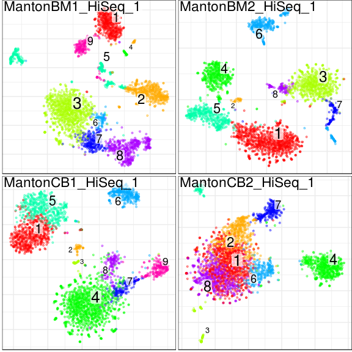

Next we will build the joint graph that emcompasses all the samples. We do that by pairwise projecting samples onto a common space and establishing kNN of mNN pairs between the samples. We then append iwthin sample kNN neighbours to the graph to ensure that all the cell are included in the graph. We will use 'PCA' space here, which is faster than the default 'CPCA' space, and in most cases gives reasonable results. If your datasets were all measured on the same platform you may also want to consider "genes" space which can give better resolution in such (simpler) cases. Other parameters passed to the `buildGraph()` function below are all default values - so are shown just for information.

``` r
con$buildGraph(k=15, k.self=10, k.self.weight=0.1, space='PCA', ncomps=50, n.odgenes=2000, matching.method='mNN', metric='angular', verbose=TRUE)
```

    ## found 0 out of 6 cached PCA  space pairs ... running 6 additional PCA  space pairs  done
    ## inter-sample links using  mNN   done
    ## local pairs local pairs  done
    ## building graph ..done

Note: as pairwise comparisons may take a while, Conos will cache results for each space. If you want to recalculate, for instance PCA, pairings with different set of parameters (e.g. more components, different number of starting overdispersed genes), clear the cache first by doing `con$pairs$PCA <- NULL`.

We next use the graph we identified to get global clusters. Here we use mutlievel to obtain clusters.

``` r
con$findCommunities(method=leiden.community, min.group.size=0)
```

We can now plot the clusters we obtained. Note that the cluster numbers between different samples now correspond to the same cell type. Also not the presence of cluster 5 in BM samples only, but not in CB.

``` r
con$plotPanel()
```

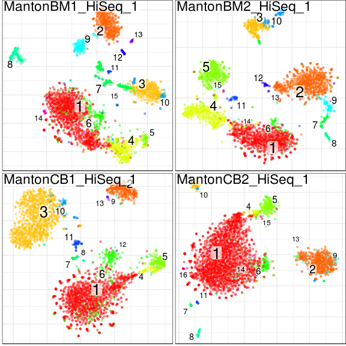

Check an expression pattern of a specific gene across all the individual embeddings.

``` r
con$plotPanel(gene = 'GZMK')
```

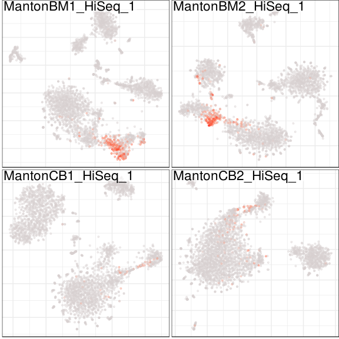

Next we embed and visualize the complete joint graph: note: embedding estimation will run the first time around. Please see `$embedGraph()` function for additional embedding options.

``` r
con$plotGraph()
```

    ## Estimating embeddings.

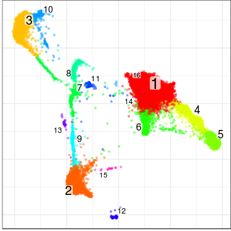

We note that the graph captures the population structure irrespecively of the sample of origin of each cell.

``` r
con$plotGraph(color.by='sample',mark.groups=F,alpha=0.1,show.legend=T)
```

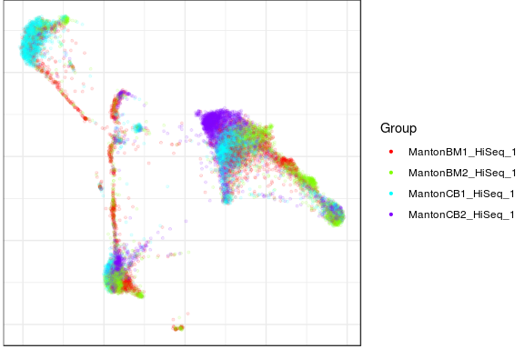

We can also visualize gene expression on this joint graph embedding:

``` r
con$plotGraph(gene='GZMK',title='GZMK expression')
```

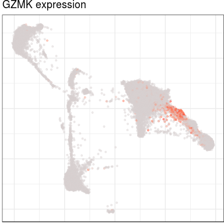

Other community detection methods can provide a more sensitive and hierarchical view of the subpopulation structure. Here we run walktrap community detection method on the same joint graph:

``` r
con$findCommunities(method = igraph::walktrap.community, steps=4)
```

Note: different clustering results are kept as a simple list under `con$clusters`.

Visualize new clusters:

``` r
con$plotPanel(clustering='walktrap',font.size=4)
```

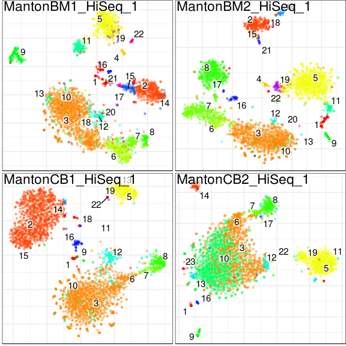

New clustering, as viewed on a joint graph:

``` r
con$plotGraph(clustering='walktrap')
```

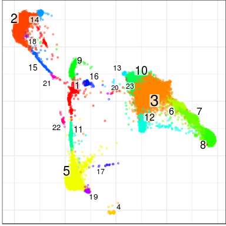

Exploring hierarchical community structure
==========================================

Walktrap clustering generates a hierarchical community structure.

We can get a cut of the top dendrogram and visualize it. Here we'll cut to get 40 top clusters.

``` r
fc <- greedyModularityCut(con$clusters$walktrap$result,40);
```

The cut determines a finer clustering (likely overclustering) of the dataset on its leafs:

``` r
con$plotGraph(groups=fc$groups)
```

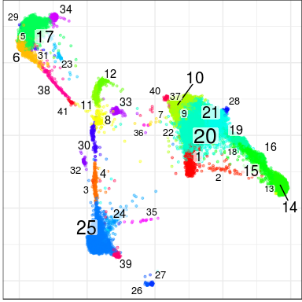

Let's look at the hierarchical structure of these clusters:

``` r
# fc$hc is an hclust structure ... here we will convert it to a dendrogram
dend <- as.dendrogram(fc$hc)
plot(dend)
```

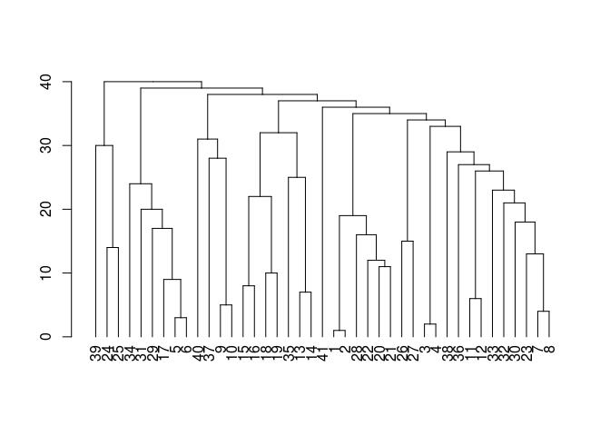

We can modify the dendrogram to show various properties. For instance, alter the width of the edges to reflect how many samples are contributing to it (normalized entropy). To do so, let's first define a factor specifying which samples different samples came from:

``` r
samf <- lapply(panel,colnames)
samf <- as.factor(setNames(rep(names(samf),unlist(lapply(samf,length))),unlist(samf)))
str(samf)
```

    ##  Factor w/ 4 levels "MantonBM1_HiSeq_1",..: 1 1 1 1 1 1 1 1 1 1 ...
    ##  - attr(*, "names")= chr [1:12000] "MantonBM1_HiSeq_1-TCTATTGGTCTCTCGT-1" "MantonBM1_HiSeq_1-GAATAAGTCACGCATA-1" "MantonBM1_HiSeq_1-ACACCGGTCTAACTTC-1" "MantonBM1_HiSeq_1-TCATTTGGTACGCTGC-1" ...

Now we'll use `dend.set.width.by.breadth()` function to calculate the entropies of each edge and set the width accordingly:

``` r
dend <- dendSetWidthByBreadth(dend,samf,fc$leafContent, min.width=1, max.width=4)
plot(dend)
```

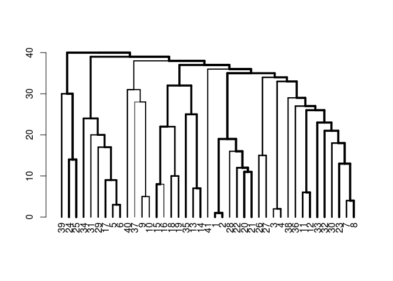

Similarly, we can finde a factor that labels cells by the tissue they are from (in this case BM or CB). To define the factor for this simple dataset, we'll simply parse the cell names:

``` r
tissue.factor <- as.factor(setNames( ifelse(grepl('BM',names(samf)),'BM','CB'), names(samf)))
str(tissue.factor)
```

    ##  Factor w/ 2 levels "BM","CB": 1 1 1 1 1 1 1 1 1 1 ...
    ##  - attr(*, "names")= chr [1:12000] "MantonBM1_HiSeq_1-TCTATTGGTCTCTCGT-1" "MantonBM1_HiSeq_1-GAATAAGTCACGCATA-1" "MantonBM1_HiSeq_1-ACACCGGTCTAACTTC-1" "MantonBM1_HiSeq_1-TCATTTGGTACGCTGC-1" ...

Now, let's color the edges according to the tissue mixture:

``` r
dend <- dendSetColorByMixture(dend,tissue.factor,fc$leafContent)
plot(dend)
```

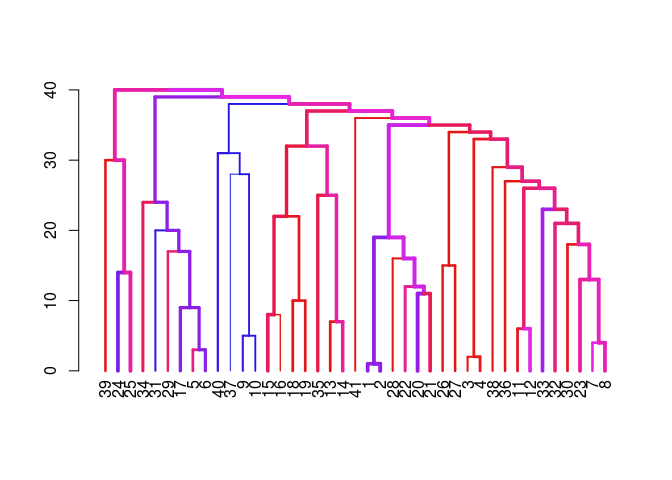

An alternative way to explore this the hierarchical community structure using an interactive app. The app also allows to visualize tissue composition and sample similarities:

``` r
conosShinyApp(con,N=30)
```

Label propagation
=================

One of the uses of this graph is to propagate labels. For example in some cases we will only have information about the cell types in one of the samples and we want to automatically label the other samples. We'll load annotation from a simple text file (first column giving cell name, second - cell type), and make a named factor out of it:

``` r
cellannot <- read.table(file.path(find.package('conos'),'extdata','cellannot.txt'),header=F,sep='\t')
cellannot <- setNames(cellannot[,2],cellannot[,1])
```

Next we plot our panel with the annotations we made. This is to verify that the annotated cells are indeed in only one sample and that the other samples are unlabelled.

``` r
con$plotPanel(groups = cellannot)
```

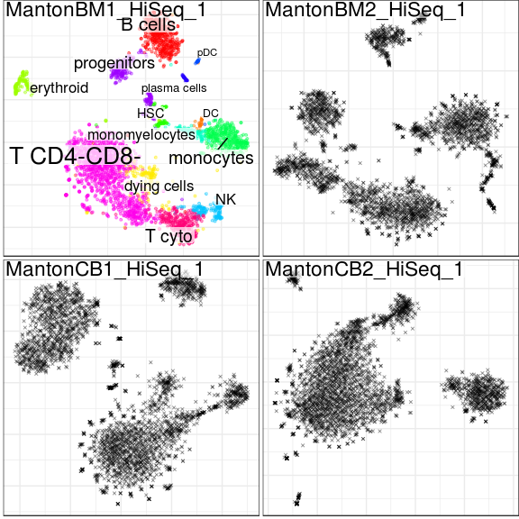

Next let's propagaes the labels from the one annotated sample to the other samples.

``` r
new.label.probabilities <- con$propagateLabels(labels = cellannot,verbose = T)
```

This function returns probabilites of the cell belonging to each group, we can assign each cell to the the the cell type with the highest probability.

``` r
new.annot <- setNames(colnames(new.label.probabilities)[apply(new.label.probabilities,1,which.max)], rownames(new.label.probabilities))
head(new.annot)
```

    ## MantonBM1_HiSeq_1-AGCTCTCCAATCGAAA-1 MantonBM2_HiSeq_1-CTGATAGAGCGTTCCG-1 
    ##                                 "NK"                                 "NK" 
    ## MantonBM1_HiSeq_1-TGGCTGGGTCGGCATC-1 MantonBM1_HiSeq_1-GAGTCCGTCTGTCCGT-1 
    ##                                 "NK"                                 "NK" 
    ## MantonBM1_HiSeq_1-ATTGGACAGTGTACTC-1 MantonBM1_HiSeq_1-GACCAATTCAACACAC-1 
    ##                                 "NK"                                 "NK"

We not see that all our samples have been labelled automagically!

``` r
con$plotPanel(groups = new.annot)
```

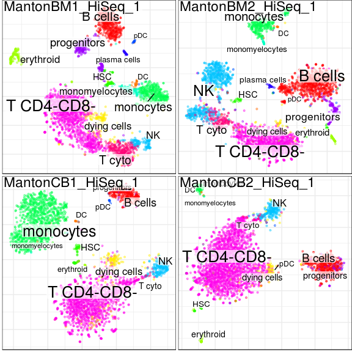
