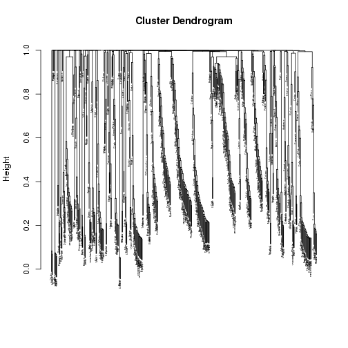
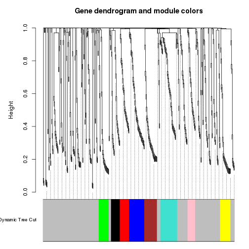
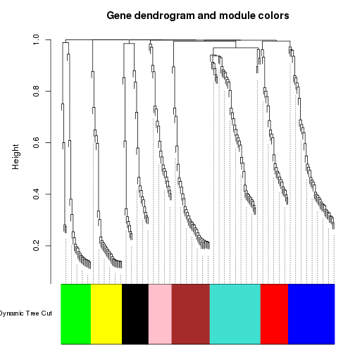
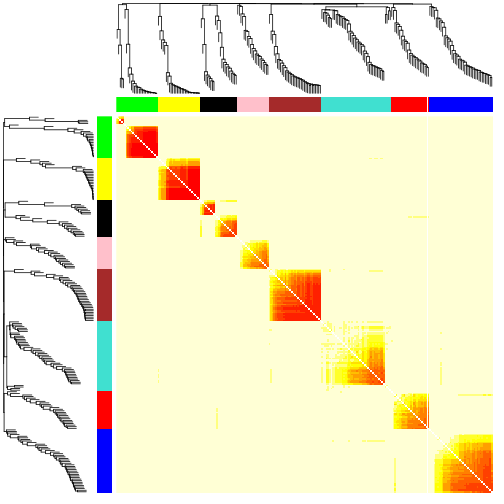

WGCNA: Weighted gene co-expression network analysis
========================================================
This code has been adapted from the tutorials available at [WGCNA website](http://labs.genetics.ucla.edu/horvath/CoexpressionNetwork/Rpackages/WGCNA/)

Installing required packages:
WGCNA requires the following packages to be installed,
one of them is only available through bioconductor

```r
install.packages(c("dynamicTreeCut", "cluster", "flashClust", "Hmisc", "reshape", "foreach", "doParallel") ) 
source("http://bioconductor.org/biocLite.R") 
biocLite("impute")
install.packages("WGCNA")
```

Loading WGCNA library, and settings to allow parallel execution


```r
library(WGCNA)
```

```
## Loading required package: dynamicTreeCut
## Loading required package: flashClust
## 
## Attaching package: 'flashClust'
## 
## The following object is masked from 'package:stats':
## 
##     hclust
```

```
## ==========================================================================
## *
## *  Package WGCNA 1.41.1 loaded.
## *
## *    Important note: It appears that your system supports multi-threading,
## *    but it is not enabled within WGCNA in R. 
## *    To allow multi-threading within WGCNA with all available cores, use 
## *
## *          allowWGCNAThreads()
## *
## *    within R. Use disableWGCNAThreads() to disable threading if necessary.
## *    Alternatively, set the following environment variable on your system:
## *
## *          ALLOW_WGCNA_THREADS=<number_of_processors>
## *
## *    for example 
## *
## *          ALLOW_WGCNA_THREADS=12
## *
## *    To set the environment variable in linux bash shell, type 
## *
## *           export ALLOW_WGCNA_THREADS=12
## *
## *     before running R. Other operating systems or shells will
## *     have a similar command to achieve the same aim.
## *
## ==========================================================================
```

```
## 
## Attaching package: 'WGCNA'
## 
## The following object is masked from 'package:stats':
## 
##     cor
```

```r
options(stringsAsFactors = FALSE);
enableWGCNAThreads()
```

```
## Allowing parallel execution with up to 11 working processes.
```

Loading the data:
WGCNA requires genes be given in the columns


```r
load("oed.RData")
dim(oed)
```

```
## [1] 17372    92
```

```r
gene.names=rownames(oed)
trans.oed=t(oed)
```

For the purpose of this exercise, we focus on a smaller set of genes


```r
n=500;
datExpr=trans.oed[,1:n]
dim(datExpr)
```

```
## [1]  92 500
```

```r
SubGeneNames=gene.names[1:n]
```

Choosing a soft-threshold to fit a scale-free topology to the network


```r
powers = c(c(1:10), seq(from = 12, to=20, by=2));
sft=pickSoftThreshold(datExpr,dataIsExpr = TRUE,powerVector = powers,corFnc = cor,corOptions = list(use = 'p'),networkType = "unsigned")
```

```
##    Power SFT.R.sq  slope truncated.R.sq mean.k. median.k. max.k.
## 1      1    0.719 -1.700          0.874   40.60    37.900  102.0
## 2      2    0.521 -0.707          0.679   15.00    12.500   40.0
## 3      3    0.814 -0.476          0.764    9.92     7.970   25.9
## 4      4    0.900 -0.671          0.887    7.73     5.790   23.6
## 5      5    0.803 -0.809          0.748    6.47     4.140   22.2
## 6      6    0.749 -0.901          0.677    5.63     3.610   21.1
## 7      7    0.880 -0.913          0.846    5.02     3.100   20.2
## 8      8    0.885 -0.928          0.853    4.55     2.610   19.4
## 9      9    0.849 -0.940          0.806    4.17     2.170   18.6
## 10    10    0.918 -0.940          0.896    3.86     1.890   18.0
## 11    12    0.897 -0.942          0.867    3.36     1.610   16.8
## 12    14    0.882 -0.949          0.849    2.99     1.360   15.8
## 13    16    0.819 -0.996          0.770    2.69     1.180   15.0
## 14    18    0.890 -0.974          0.858    2.44     0.997   14.3
## 15    20    0.885 -0.987          0.852    2.24     0.802   13.7
```

```r
# Plot the results
sizeGrWindow(9, 5)
par(mfrow = c(1,2));
cex1 = 0.9;

# Scale-free topology fit index as a function of the soft-thresholding power
plot(sft$fitIndices[,1], -sign(sft$fitIndices[,3])*sft$fitIndices[,2],xlab="Soft Threshold (power)",ylab="Scale Free Topology Model Fit, signed R^2",type="n", main = paste("Scale independence"));
text(sft$fitIndices[,1], -sign(sft$fitIndices[,3])*sft$fitIndices[,2],labels=powers,cex=cex1,col="red");

# Red line corresponds to using an R^2 cut-off
abline(h=0.80,col="red")

# Mean connectivity as a function of the soft-thresholding power
plot(sft$fitIndices[,1], sft$fitIndices[,5],xlab="Soft Threshold (power)",ylab="Mean Connectivity", type="n",main = paste("Mean connectivity"))
text(sft$fitIndices[,1], sft$fitIndices[,5], labels=powers, cex=cex1,col="red")
```


Generating adjacency and TOM similarity matrices based on the selected softpower


```r
softPower = 7;

#calclute the adjacency matrix
adj= adjacency(datExpr,type = "unsigned", power = softPower);

#turn adjacency matrix into topological overlap to minimize the effects of noise and spurious associations
TOM=TOMsimilarityFromExpr(datExpr,networkType = "unsigned", TOMType = "unsigned", power = softPower);
```

```
## TOM calculation: adjacency..
## ..will use 11 parallel threads.
##  Fraction of slow calculations: 0.000000
## ..connectivity..
## ..matrix multiplication..
## ..normalization..
## ..done.
```

```r
colnames(TOM) =rownames(TOM) =SubGeneNames
dissTOM=1-TOM
```


Module detection


```r
#hierarchical clustering of the genes based on the TOM dissimilarity measure
geneTree = flashClust(as.dist(dissTOM),method="average");

#plot the resulting clustering tree (dendrogram)
plot(geneTree, xlab="", sub="",cex=0.3);
```

 

```r
# Set the minimum module size
minModuleSize = 20;

# Module identification using dynamic tree cut

dynamicMods = cutreeDynamic(dendro = geneTree,  method="tree", minClusterSize = minModuleSize);
#dynamicMods = cutreeDynamic(dendro = geneTree, distM = dissTOM, method="hybrid", deepSplit = 2, pamRespectsDendro = FALSE, minClusterSize = minModuleSize);

#the following command gives the module labels and the size of each module. Lable 0 is reserved for unassigned genes
table(dynamicMods)
```

```
## dynamicMods
##   0   1   2   3   4   5   6   7   8 
## 263  44  40  33  27  26  24  23  20
```

```r
#Plot the module assignment under the dendrogram; note: The grey color is reserved for unassigned genes
dynamicColors = labels2colors(dynamicMods)
table(dynamicColors)
```

```
## dynamicColors
##     black      blue     brown     green      grey      pink       red 
##        23        40        33        26       263        20        24 
## turquoise    yellow 
##        44        27
```

```r
plotDendroAndColors(geneTree, dynamicColors, "Dynamic Tree Cut", dendroLabels = FALSE, hang = 0.03, addGuide = TRUE, guideHang = 0.05, main = "Gene dendrogram and module colors")
```

 

```r
#discard the unassigned genes, and focus on the rest
restGenes= (dynamicColors != "grey")
diss1=1-TOMsimilarityFromExpr(datExpr[,restGenes], power = softPower)
```

```
## TOM calculation: adjacency..
## ..will use 11 parallel threads.
##  Fraction of slow calculations: 0.000000
## ..connectivity..
## ..matrix multiplication..
## ..normalization..
## ..done.
```

```r
colnames(diss1) =rownames(diss1) =SubGeneNames[restGenes]
hier1=flashClust(as.dist(diss1), method="average" )
plotDendroAndColors(hier1, dynamicColors[restGenes], "Dynamic Tree Cut", dendroLabels = FALSE, hang = 0.03, addGuide = TRUE, guideHang = 0.05, main = "Gene dendrogram and module colors")
```

 

```r
#set the diagonal of the dissimilarity to NA 
diag(diss1) = NA;

#Visualize the Tom plot. Raise the dissimilarity matrix to the power of 4 to bring out the module structure
sizeGrWindow(7,7)
TOMplot(diss1, hier1, as.character(dynamicColors[restGenes]))
```

 

Extract modules

```r
module_colors= setdiff(unique(dynamicColors), "grey")
for (color in module_colors){
    module=SubGeneNames[which(dynamicColors==color)]
    write.table(module, paste("module_",color, ".txt",sep=""), sep="\t", row.names=FALSE, col.names=FALSE,quote=FALSE)
}
```

Look at expression patterns of these genes, as they're clustered

```r
module.order <- unlist(tapply(1:ncol(datExpr),as.factor(dynamicColors),I))
m<-t(t(datExpr[,module.order])/apply(datExpr[,module.order],2,max))
heatmap(t(m),zlim=c(0,1),col=gray.colors(100),Rowv=NA,Colv=NA,labRow=NA,scale="none",RowSideColors=dynamicColors[module.order])
```

 

We can now look at the module gene listings and try to interpret their functions ..
for instance using http://amigo.geneontology.org/rte

Quantify module similarity by eigengene correlation. Eigengenes: Module representatives


```r
MEList = moduleEigengenes(datExpr, colors = dynamicColors)
MEs = MEList$eigengenes
plotEigengeneNetworks(MEs, "", marDendro = c(0,4,1,2), marHeatmap = c(3,4,1,2))
```

 


