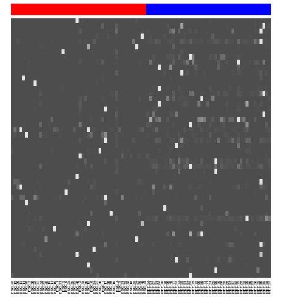
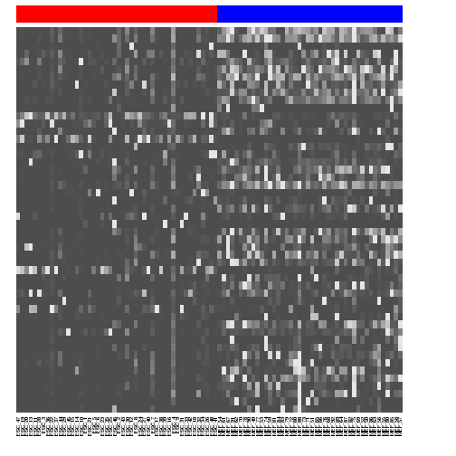
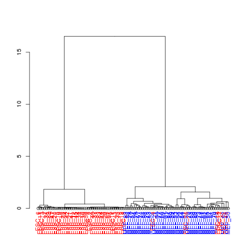
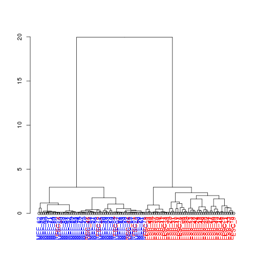
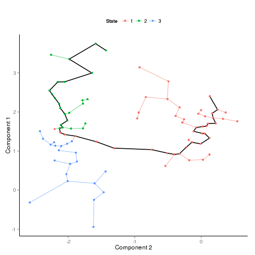

# Getting started with Monocle

## Installation

The following has already been done for you. This information is provided for your reference. For more information, please see [the Monocle tutorial](http://monocle-bio.sourceforge.net/tutorial.html) or [the Monocle paper](http://www.nature.com/nmeth/journal/v11/n5/full/nmeth.2946.html).

Monocle runs in the R statistical computing environment. You will need R version 3.0 or higher. 
```bash
    $ /opt/R-3.1.0/bin/R
```
You will need to install a few packages through CRAN. You can install these packages by starting an R session and typing: 

```r
    install.packages(c("VGAM", "irlba", "matrixStats", "igraph", "combinat", "fastICA", "grid", "ggplot2",  "reshape2", "plyr", "parallel", "methods"))
```
You will also need to install Bioconductor: 

```r
    source("http://bioconductor.org/biocLite.R") 
    biocLite()
```
To install the Monocle package, download the source tarball, change to the directory in which you saved it, and type
```bash
    $ /opt/R-3.1.0/bin/R CMD INSTALL HSMMSingleCell_0.99.0.tar.gz 
    $ /opt/R-3.1.0/bin/R CMD INSTALL monocle_0.99.0.tar.gz 
```
To ensure that Monocle was installed correctly, start a new R session and type:

```r
   library(monocle)
```
## Computing Single Cell Trajectories with Monocle

The following commands are all done in R. Try it out!

Remember to connect to an interactive queue and load R if you have not already done so.
```bash    
    $ bsub -n 2 -Is -q interactive bash
    $ /opt/R-3.1.0/bin/R
```
### Getting Started 

Monocle holds single cell expression data in objects of the CellDataSet class. This section teaches you how to create this CellDataSet object. 

#### Load Monocle

All dependencies will also be loaded automatically.


```r
library(monocle)
```

#### Get expression data

Monocle takes as input a matrix of expression values, such as fpkms as calculated by Cufflinks. For more information, see [the Monocle vignette](http://monocle-bio.sourceforge.net/monocle-vignette.pdf). For this exercise, we have precomputed fpkms for ES and MEF cells and organized the output into a matrix with genes as rows and cells as columns for you. So just load the data.


```r
load("oed_win.RData")
expression.data <- oed
expression.data[1:10,1:5]
```

```
##        ESC_47 ESC_19 ESC_20 ESC_13 ESC_11
## Igfbp5  5.851  9.006  0.000   0.00 3.8424
## Rgs5    3.192  0.000  2.074   0.00 0.5489
## Igf2    7.979  4.003  9.335   0.00 3.2935
## Grem1   0.000  1.001  0.000   0.00 7.1359
## Mmp2    7.979  8.005 14.521   1.39 9.8804
## Hmox1   2.394  2.001  3.630   0.00 5.4891
## H19     1.330  3.002 15.040   0.00 5.4891
## Mgp     7.447  7.005  6.742   0.00 0.0000
## Rab21   4.256  0.000  1.556   0.00 4.3913
## Rgs4    0.000  0.000  0.000   0.00 0.0000
```

#### Get phenotype label from sample name

Monocle also requires phenotype information, as an AnnotatedDataFrame object, for differential expression analysis. For now, we will use cell type as the phenotype data as extracted from the sample name. You can also use phenotype data such as culture condition, day captured, etc, as long as rows are cells and columns are cell attributes.


```r
pheno.data <- colnames(expression.data) # Get sample name
pheno.data <- unlist(lapply(pheno.data, function(x) strsplit(x, '_')[[1]][1])) # Get cell type from sample name
pheno.data.df <- data.frame(type=pheno.data) # Must be data frame object
rownames(pheno.data.df) <- colnames(expression.data) # Rownames must match expression data
pd <- new('AnnotatedDataFrame', data = pheno.data.df) 
```

#### Create CellDataSet object

Now we can create the CellDataSet object using our expression and phenotype data! 


```r
es.mef <- new('CellDataSet', exprs = expression.data, phenoData = pd)
```

This es.mef object will be used in downstream analysis. 

    save(es.mef, file='es_mef_CellDataSet_oedsymbol.RData')

If you are having trouble, you can always load the es.mef object that we have precomputed for you.

    load('/groups/pklab/scw2014/Monocle_Tutorial/src/es_mef_CellDataSet_oedsymbol.RData')

### Doing Quality Control 

The log-standardized gene expression values should approximate the normal curve. Plot and see if this holds true. 


```r
L <- log10(exprs(es.mef)+1)
L[L==0] <- NA
melted.dens.df <- melt(t(scale(t(L))))
```

```r
qplot(value, geom = 'density', data = melted.dens.df) + stat_function(fun = dnorm, size = 0.5, color = 'red') + xlab('Standardized log(Expression)') + ylab('Density')
```

```
## Warning: Removed 1212755 rows containing non-finite values (stat_density).
```

 

If the data does not look normal, we can add filtering based on phenotype data or other criteria could be applied at this point. For example, we may want to remove genes that are detected in too few cells or genes that are expressed too lowly. 

### Filtering (Optional)

Our dataset looks pretty normal, so filtering will not be needed. The following is provided for your reference only, in case you encounter datasets that do require filtering.

Detect how many cells express each gene above a specified threshold. Use a minimum expression threshold of 0.1 in this example.

    es.mef <- detectGenes(es.mef, min_expr = 0.1)

Identify the genes expressed in a number of cells in the data set above some threshold, in this case 10. For smaller datasets with fewer single cells, we may want to decrease this threshold to include more genes.

    expressed.genes <- rownames(fData(es.mef))[fData(es.mef)$num_cells_expressed >= 10]

### Ordering Cells by Progress

Typically, to order cells by progress, we want to reduce the number of genes analyzed. So we can select for a subset of genes that we believe are important in setting said ordering, such as overdispersed genes.

In this example, we have already ordered genes by overdispersion. So we can use the top 50 most overdispersed genes to order our cells. 


```r
ordering.genes <- row.names(es.mef)[1:50] # Select genes used for ordering
es.mef <- setOrderingFilter(es.mef, ordering.genes) # Set list of genes for ordering
es.mef <- reduceDimension(es.mef, use_irlba = F) # Reduce dimensionality
es.mef <- orderCells(es.mef, num_paths = 2, reverse = F) # Order cells
```

Note that Monocle requires you to set the number of 'paths' or trajectories that cells can be ordered into. Try experimenting with the number of paths calculated!


```r
plot_spanning_tree(es.mef) # Plot trajectory
```

 

### Analyzing Results

How well did Monocle separate MEF and ESC cells? Let's look at how the states correspond to cell type. 


```r
table(pData(es.mef)$type, pData(es.mef)$State)
```

```
##      
##        1  2  3
##   ESC  3 45  0
##   MEF 26 10  8
```


```r
plot(pData(es.mef)$type, pData(es.mef)$State)
```

```
## Warning: NAs introduced by coercion
## Warning: no non-missing arguments to min; returning Inf
## Warning: no non-missing arguments to max; returning -Inf
```

```
## Error: need finite 'xlim' values
```

 
We can redraw the spanning tree, coloring it by the (known) cell type instead:

```r
plot_spanning_tree(es.mef, color_by="type")
```

 

We only used the top 50 overdispersed genes to order our cells. If we used more genes, do you think results would improve? What happens if we use all the genes?


```r
# Use top 100 overdispersed genes
ordering.genes <- row.names(es.mef)[1:100] 
es.mef <- setOrderingFilter(es.mef, ordering.genes) 
es.mef <- reduceDimension(es.mef, use_irlba = F) 
es.mef <- orderCells(es.mef, num_paths = 2, reverse = F) 
plot_spanning_tree(es.mef) 
```

 

```r
table(pData(es.mef)$type, pData(es.mef)$State)
```

```
##      
##        1  2  3
##   ESC 43  1  4
##   MEF  4 23 17
```

```r
# Use top 500 overdispersed genes
ordering.genes <- row.names(es.mef)[1:500] 
es.mef <- setOrderingFilter(es.mef, ordering.genes) 
es.mef <- reduceDimension(es.mef, use_irlba = F) 
es.mef <- orderCells(es.mef, num_paths = 2, reverse = F) 
plot_spanning_tree(es.mef) 
```

 

```r
table(pData(es.mef)$type, pData(es.mef)$State)
```

```
##      
##        1  2  3
##   ESC 39  7  2
##   MEF  3 27 14
```

What if we integrated prior knowledge to use genes that we know should be differentially expressed between ES and MEF cells?
