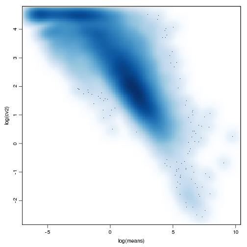
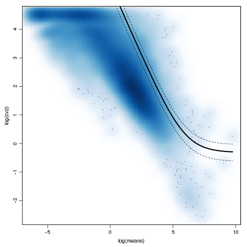
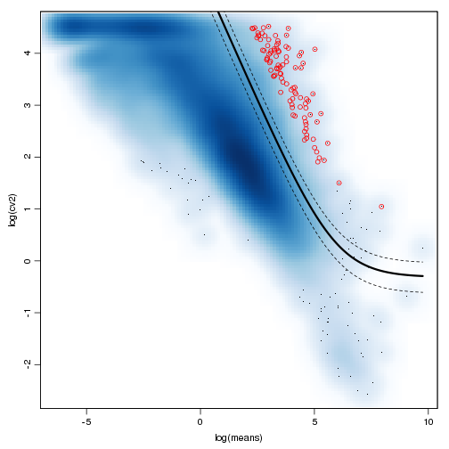
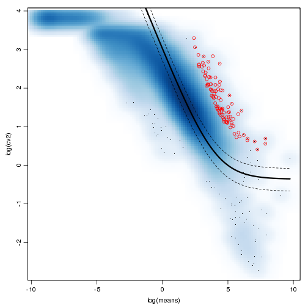
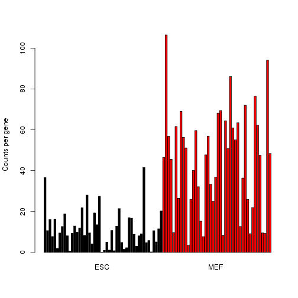
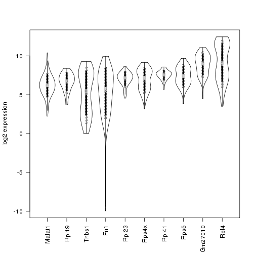
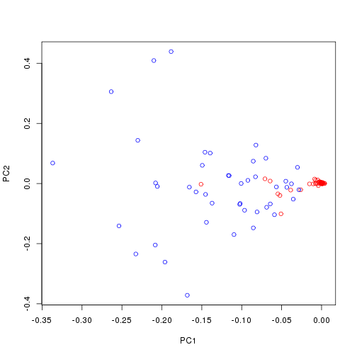
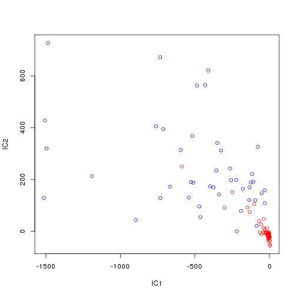
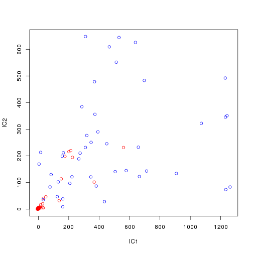
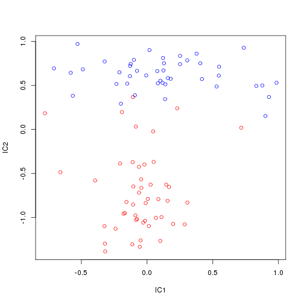

Load required libraries

```r
library(DESeq); library(statmod); library(pcaMethods); library(fastICA)
```

## Identifying highly variable genes

We'll start with the count matrix that was prepared in the previous exercise. 

```r
load("counts.RData")
```
      	          
In case something went wrong with the previous exercise, you can load a clean version by issuing the following command:
  load("/groups/pklab/scw2014/tutorials/counts.RData")


To get normalized expression magnitudes, estimate library size using DESeq and convert counts to expression magnitudes:

(note: $counts$ variable was defined in differential_expression.Rmd)

```r
require(DESeq)
lib.size <- estimateSizeFactorsForMatrix(counts)
ed <- t(t(counts)/lib.size)
```

Calculate estimates of variance, coefficient of variation

```r
means <- rowMeans(ed)
vars <- apply(ed,1,var)
cv2 <- vars/means^2
par(mar=c(3.5,3.5,1,1),mgp=c(2,0.65,0),cex=0.9)
smoothScatter(log(means),log(cv2))
```

 

Now fit a regression line based on the controls:

```r
require(statmod)
minMeanForFit <- unname( quantile( means[ which( cv2 > .3 ) ], .95 ) )
useForFit <- means >= minMeanForFit # & spikeins
fit <- glmgam.fit( cbind( a0 = 1, a1tilde = 1/means[useForFit] ),cv2[useForFit] )
a0 <- unname( fit$coefficients["a0"] )
a1 <- unname( fit$coefficients["a1tilde"])
fit$coefficients
```

```
##       a0  a1tilde 
##   0.7307 263.0521
```

Now add the fit and the 95% confidence interval to our plot:

```r
# repeat previous plot
par(mar=c(3.5,3.5,1,1),mgp=c(2,0.65,0),cex=0.9); smoothScatter(log(means),log(cv2));
xg <- exp(seq( min(log(means[means>0])), max(log(means)), length.out=1000 ))
vfit <- a1/xg + a0
# add fit line
lines( log(xg), log(vfit), col="black", lwd=3 )
df <- ncol(ed) - 1
# add confidence interval
lines(log(xg),log(vfit * qchisq(0.975,df)/df),lty=2,col="black")
lines(log(xg),log(vfit * qchisq(0.025,df)/df),lty=2,col="black")
```

 

Rank genes by the significance of deviation from the fit

```r
afit <- a1/means+a0
varFitRatio <- vars/(afit*means^2)
varorder <- order(varFitRatio,decreasing=T)
oed <- ed[varorder,]
# save for the next exercise
save(oed,file="oed.RData")

# repeat previous plot
par(mar=c(3.5,3.5,1,1),mgp=c(2,0.65,0),cex=0.9); smoothScatter(log(means),log(cv2)); lines( log(xg), log(vfit), col="black", lwd=3 ); lines(log(xg),log(vfit * qchisq(0.975,df)/df),lty=2,col="black"); lines(log(xg),log(vfit * qchisq(0.025,df)/df),lty=2,col="black");
# add top 100 genes
points(log(means[varorder[1:100]]),log(cv2[varorder[1:100]]),col=2)
```

 

We can also evaluate statistical significance of the deviation

```r
pval <- pchisq(varFitRatio*df,df=df,lower.tail=F)
adj.pval <- p.adjust(pval,"fdr")
sigVariedGenes <- adj.pval<1e-3;
table(sigVariedGenes)
```

```
## sigVariedGenes
## FALSE  TRUE 
## 17115   257
```


Look at how the most variable genes are expressed ... 

```r
m <- oed[1:50,]
heatmap(m/apply(m,1,max),zlim=c(0,1),col=gray.colors(100),Rowv=NA,Colv=NA,labRow=NA,scale="none",ColSideColors=ifelse(grepl("ES",colnames(m)),"red","blue"))
```

 

Let's apply Winsorization procedure to the expression matrix

```r
winsorize <- function (x, fraction=0.05) {
   if(length(fraction) != 1 || fraction < 0 ||
         fraction > 0.5) {
      stop("bad value for 'fraction'")
   }
   lim <- quantile(x, probs=c(fraction, 1-fraction))
   x[ x < lim[1] ] <- lim[1]
   x[ x > lim[2] ] <- lim[2]
   x
}

# winsorize to remove 2 most extreme cells (from each side)
wed <- t(apply(ed, 1, winsorize, fraction=2/ncol(ed)))

# now let's recalculate the most variable genes with the winsorized matrix (wed)
means = rowMeans(wed); vars = apply(wed,1,var); cv2 <- vars/means^2
useForFit <- means >= unname( quantile( means[ which( cv2 > .3 ) ], .95 ) ) 
fit <- glmgam.fit( cbind( a0 = 1, a1tilde = 1/means[useForFit] ),cv2[useForFit] )
afit <- fit$coef["a1tilde"]/means+fit$coef["a0"]
vfit <- fit$coef["a1tilde"]/xg+fit$coef["a0"]
varFitRatio <- vars/(afit*means^2)
varorder <- order(varFitRatio,decreasing=T)
oed <- wed[varorder,]
# save for the next exercise
save(oed,file="oed_win.RData")

xg <- exp(seq( min(log(means[means>0])), max(log(means)), length.out=1000 ))
par(mar=c(3.5,3.5,1,1),mgp=c(2,0.65,0),cex=0.9); smoothScatter(log(means),log(cv2)); lines( log(xg), log(vfit), col="black", lwd=3 ); lines(log(xg),log(vfit * qchisq(0.975,df)/df),lty=2,col="black"); lines(log(xg),log(vfit * qchisq(0.025,df)/df),lty=2,col="black");
# add top 100 genes
points(log(means[varorder[1:100]]),log(cv2[varorder[1:100]]),col=2)
```

 

Let's redraw the top 50 most variable genes:

```r
m <- oed[1:50,]
heatmap(m/apply(m,1,max),zlim=c(0,1),col=gray.colors(100),Rowv=NA,Colv=NA,labRow=NA,scale="none",ColSideColors=ifelse(grepl("ES",colnames(m)),"red","blue"))
```

 

## Heterogeneity analysis through clustering
Cluster cells based on correlation of expression values ..

```r
plot(hclust(as.dist(1-cor(ed))))
```

 

Let's color nodes according to cell type.

```r
# labeling function
colLab <- function(n) {
  if(is.leaf(n)) {
    a <- attributes(n);
    attr(n,"nodePar") <- c(a$nodePar,list(lab.col=ifelse(grepl("ES",a$label),"red","blue")));
  }
  n
}
clust <- hclust(as.dist(1-cor(ed)),method="ward");
```

```
## The "ward" method has been renamed to "ward.D"; note new "ward.D2"
```

```r
plot(dendrapply(as.dendrogram(clust),colLab),cex=0.7)
```

 

Use top 100 most variable genes from the winsorized matrix:

```r
clust <- hclust(as.dist(1-cor(oed[1:100,],method="p")),method="ward");
```

```
## The "ward" method has been renamed to "ward.D"; note new "ward.D2"
```

```r
plot(dendrapply(as.dendrogram(clust),colLab),cex=0.7)
```

 
We can also use weighted distance measures to reduce the contribution of the technical noise. Please see [SCDE tutorial](http://pklab.med.harvard.edu/scde/Tutorials/#Adjusteddistancemeaures) for further details.
Note: the block below fits error models for all 90+ cells, so it takes a while.

```r
require(scde)
scde.fitted.model <- scde.error.models(counts=counts,n.cores=n.cores,save.model.plots=F)
scde.prior <- scde.expression.prior(models=scde.fitted.model,counts=counts)

jp <- scde.posteriors(models=scde.fitted.model,counts,scde.prior,return.individual.posterior.modes=T,n.cores=n.cores)

jp$jp.modes <- log(as.numeric(colnames(jp$jp)))[max.col(jp$jp)]
p.mode.fail <- scde.failure.probability(models=scde.fitted.model,magnitudes=jp$jp.modes)
p.self.fail <- scde.failure.probability(models=scde.fitted.model,counts=counts)
# weight matrix
matw <- 1-sqrt(p.self.fail*sqrt(p.self.fail*p.mode.fail))
# magnitude matrix (using individual posterior modes here)
mat <- log10(exp(jp$modes)+1);
# weighted distance
cell.names <- colnames(counts); names(cell.names) <- cell.names;

require(boot)
mode.fail.dist <- as.dist(1-do.call(rbind,mclapply(cell.names,function(nam1) {
  unlist(lapply(cell.names,function(nam2) {
    corr(cbind(mat[,nam1],mat[,nam2]),w=sqrt(sqrt(matw[,nam1]*matw[,nam2])))
  }))
},mc.cores=n.cores)),upper=F);

save(mode.fail.dist,file="mode.fail.dist.RData")
```

The calculation above takes some time, so let's just use a pre-calculated distance:

```r
load("/groups/pklab/scw2014/tutorials/mode.fail.dist.RData")
clust <- hclust(mode.fail.dist,method="ward");
```

```
## The "ward" method has been renamed to "ward.D"; note new "ward.D2"
```

```r
plot(dendrapply(as.dendrogram(clust),colLab),cex=0.7)
```

 


## Using PCA and ICA to separate subpopulations
First, let's try applying PCA to the complete set of genes

```r
require(pcaMethods)
pcs <- pca(oed,nPcs=5)
plot(loadings(pcs)[,1],loadings(pcs)[,2],col=ifelse(grepl("ES",colnames(oed)),"red","blue"),xlab="PC1",ylab="PC2")
```

 

We can get similarly good separation with just the top 100 most variable genes

```r
pcs <- pca(oed[1:100,],nPcs=5)
plot(loadings(pcs)[,1],loadings(pcs)[,2],col=ifelse(grepl("ES",colnames(oed)),"red","blue"),xlab="PC1",ylab="PC2")
```

 

ICA is another popular dimensionality reduction approach:

```r
require(fastICA)
ics <- fastICA(oed[1:100,],n.comp=4)
plot(ics$A[1,],ics$A[2,],col=ifelse(grepl("ES",colnames(oed)),"red","blue"),xlab="IC1",ylab="IC2")
```

 

More information may be contained in further independent components:

```r
plot(ics$A[3,],ics$A[4,],col=ifelse(grepl("ES",colnames(oed)),"red","blue"),xlab="IC1",ylab="IC2")
```

 

The large spread is often drive by large range of expression magnitudes, with high-magnitude genes driving the expression variation and patterns. This can be corrected using "variance-stabilizing transformations", or at least transformations that alter the variance relationships. One simple approach, would be to take square root or a log of the expression magnitudes:

```r
ics <- fastICA(log(oed[1:100,]+1),n.comp=4)
plot(ics$A[1,],ics$A[2,],col=ifelse(grepl("ES",colnames(oed)),"red","blue"),xlab="IC1",ylab="IC2")
```

 


