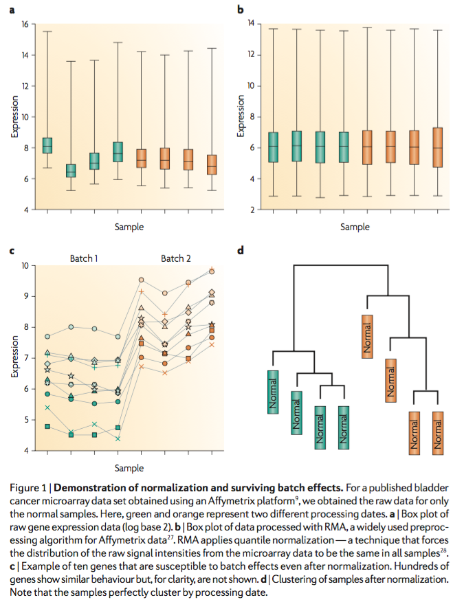
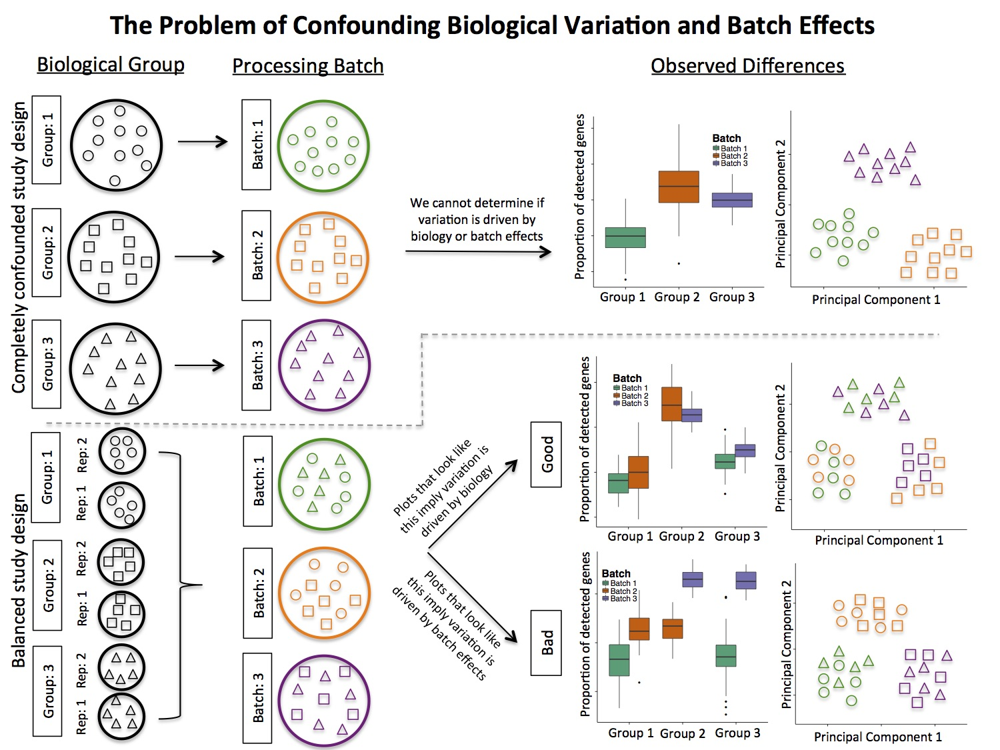
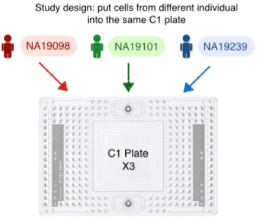
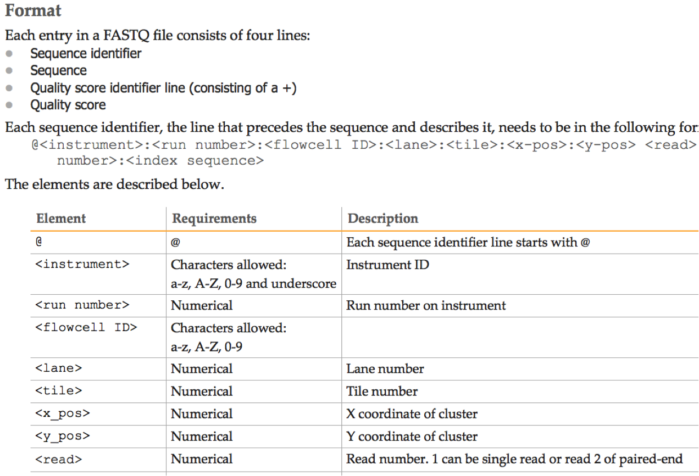
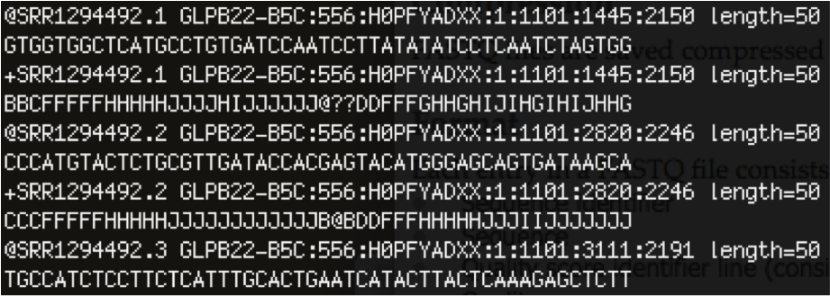
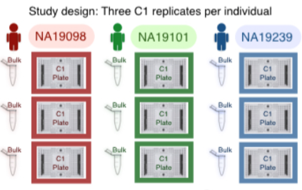

```{r load libararies, message=FALSE, warning=FALSE}
library(knitr)
library(scater)
library(scran)
library(cowplot)
knitr::opts_chunk$set(cache = TRUE, warning = FALSE)
```


# Batch effects

## What are batch effects? 

* Common and powerful source of variation in high-throughput experiments
* Hidden factors that can quantitatively alter the observed measurements across conditions unrelated to the biological or scientific variables in a study
* Can remain even after "normalizing" the data. e.g. Figure 1 from [Leek et al. (2010)](https://www.ncbi.nlm.nih.gov/pubmed/20838408):




### Surrogates for other sources of information

* Most common to define batch of samples based when/how samples were processed
    * e.g. sample processing time/date, sequencing date, different protocols in the laboratory
* These are only **surrogates** for other sources of variation not recorded
    * e.g. laboratory-specific effects, reaction temperatures, PCR reagents/conditions etc


## Experimental design in scRNA-Seq

See [Bacher and Kendziorski (2016)](https://genomebiology.biomedcentral.com/articles/10.1186/s13059-016-0927-y) on 'Design and computational analysis of single-cell RNA-sequencing experiments' for detailed information on experimental design in scRNA-Seq.

* Similar to bulk RNA-Seq, important to randomize (or balance) design across as many factors as possible to not introduce artifacts imposed from sample preparation or data collection.

* In some cases, a fully randomized experiment is not possible and compromises are made in practice:
    * e.g. cost, time, capacity, limited samples, platforms to isolate and sequence cells
    * Most frequently, we cannot avoid batching cells, so replication is critical (samples must be processed in multiple batches) (more on this later).

* Potential limiting factors in experimental design that must be balanced with experimental design
    * Protocols to isolate cells [see [Saliba et al. (2014)](http://www.ncbi.nlm.nih.gov/pubmed/25053837) and [Kolodziejczyk et al. (2015)](http://www.ncbi.nlm.nih.gov/pubmed/26000846)]
    * Protocols to extract mRNA from isolate cells [see [Grun and van Oudenaarden (2015)](http://www.ncbi.nlm.nih.gov/pubmed/26544934), [Saliba et al. (2014)](http://www.ncbi.nlm.nih.gov/pubmed/25053837) and [Kolodziejczyk et al. (2015)](http://www.ncbi.nlm.nih.gov/pubmed/26000846)]
    * Protocols for extracting RNA from isolate cell and convert to cDNA
        * Can vary with respect to transcript coverage and strand specificity
    * Choice of sequencing platform, time and budget constraints
    * Choice to use synthetic spike-ins (or not) or unique molecular identifiers UMIs [see [Stegle et al. (2015)](http://www.ncbi.nlm.nih.gov/pubmed/25628217)]. 
        * Spike-ins are added at a high concentration and can take up a large percentage of "read landscape" in sequencing. 
        * UMIs can remove amplification bias, but are 5' or 3' end biased (bad for isoform or allele-specific expression). 

* Trade-off between number of cells and sequencing depth:
	  * Not many papers on determining minimum number of cells to sequence for a given biological question
	  * Most papers focus on the sensitivity, accuracy or defining minimum sequencing depths to observe majority of expressed genes [e.g. [Shalek et al. (2014)](http://www.ncbi.nlm.nih.gov/pubmed/24919153) and [Tung et al. (2016)](http://giphy.com/gifs/barack-obama-president-they-tried-TEFplLVRDMWBi)]


## Batch effects in scRNA-Seq

Batch effects occur when cells from one biological group or condition 
are cultured, captured and sequenced separate from cells in a second condition. 

### The big problem with batch effects 

* When batch effects are correlated (or confounded) with an outcome of interest
* In the figure in Section 1 with the bladder samples, only **normal** samples were considered. 
* Consider the case where all normal samples are processed in "Batch 1" and all cancer 
samples are processed in "Batch 2". 
    * Impossible to determine if variation is due to cancer/normal status or batch effects. 



In a completely confounded study, it is not possible to determine if the biological condition 
or batch effects are driving the observed variation. In contrast, incorporating 
biological replicates across in the experimental design and processing the replicates 
across multiple batches permits observed variation to be attributed to 
biology or batch effects [[Hicks et al. (2015)](http://biorxiv.org/content/early/2015/12/27/025528)]. 


This idea was also proposed more concretely for the C1 platform in 
[Tung et al. (2016)](http://biorxiv.org/content/early/2016/07/08/062919). The idea was 
to take isolate and sequence cells from multiple individuals within a C1 plate and obtain 
multiple C1 replicates to observe batch effect across C1 plates.



### Using FASTQ file as surrogate for "batch"

Although batch information is not always included in the experimental annotations 
that are publicly available, one can extract surrogate variables from the raw 
sequencing (FASTQ) files. 



For example, this is a screenshot of a FASTQ file. Each read contains this 
header information. 



This is how we define batches of cells, but keep in mind this is only a 
surrogate for other sources of variation. 


### How to correct for batch effects?

First, let's consider the question of where are we at in terms of methods for normalization 
and dealing with technical variation in scRNA-Seq data?


In my opinion, it's a bit like being in the "Wild West" (very much an open-ended research question)

* We're still in the early stages of dealing with the technical noise that we see 
in scRNA-Seq data through the creation of new normalization and analysis methods, 
but there is still lots of room for improvement
    * e.g. what methods are considered “the best” since most of these methods have 
    compared to methods developed for bulk RNA-Seq. 
* To add on top of that, the technologies that we’re using to isolate, sort and process 
the cells are being developed at a fairly fast pace. Just because new technologies are 
emerging doesn’t mean that technical variation is being eliminated. In fact, it’s 
usually just the opposite. When new technologies emerge, there is usually an entirely 
new set of issues that need to be dealt with. 
    * e.g. the transition from microarrays to bulk RNA-Seq

OK so what about batch effects in scRNA-Seq data? There is some good news and some bad news... 

* Bad news: Batch effects can be a big problem in scRNA-Seq data (but not always)
* Good news: Batch effects and methods to correct for batch effects have been around for many years (lots of places to start)
* Bad news: Poor experimental design is a big limiting factor. 
    * also, more complicated because of sparsity (biology and technology), capture efficiency, etc
* Good news: Increased awareness about good experimental design. New methods specific for scRNA-Seq are being developed.

What have been the approaches to computationally correct for batch effects in bulk high-throughput experiments? 

1. Explicitly model batch effects in a statistical model e.g. fixed/random effects
    * This only works assuming you have a well-designed randomized experiment with replicates. 
    * Even then, it's not straight-forward how to do with scRNA-Seq data. 
    * Additional noise observed at the single-cell level, confounded study designs, etc

2. Account/correct/adjust data in "normalization" steps
    * But batch effects can often remain in data even after "normalization" (e.g. bladder samples and more on this later too)

See [Bacher and Kendziorski (2016)](https://genomebiology.biomedcentral.com/articles/10.1186/s13059-016-0927-y), [Tung et al. (2016)](http://biorxiv.org/content/early/2016/07/08/062919), [an F1000 workflow for the analysis of scRNA-seq data](https://f1000research.com/articles/5-2122/v1) and [slides from Davis McCarthy presented at Genome Informatics 2016](https://speakerdeck.com/davismcc/what-do-we-need-computationally-to-make-the-most-of-single-cell-rna-seq-data) for more information on computationally correcting for batch effects in scRNA-Seq data with good experimental designs. 


# Case-study

OK, let's consider a case-study with some scRNA-Seq data with replicates. 

## Tung et al. (2016) human scRNA-Seq data

In this tutorial, we will use the human scRNA-Seq data from
[Tung et al. (2016)](http://biorxiv.org/content/early/2016/07/08/062919), 
which is available in a [GitHub repository](https://github.com/jdblischak/singleCellSeq). 

Below, we will read in the files directly from the web, so no need to download the files. 
If you would like to have the files on your local drive, there are a few ways of getting the files. 
If you are familiar with git, you can download the repository by using git commands: 

```
git clone https://github.com/jdblischak/singleCellSeq.git
```

Alternatively, you can also use the the command `wget` (or just manually download the files): 
```
wget https://github.com/jdblischak/singleCellSeq/raw/master/data/annotation.txt -P data
wget https://github.com/jdblischak/singleCellSeq/raw/master/data/molecules-raw-single-per-sample.txt -P data
wget https://github.com/jdblischak/singleCellSeq/raw/master/data/quality-single-cells.txt -P data
```

In the Tung et al. paper, the authors investigated the technical 
variation associated with sample processing using the single cell 
Fluidigm C1 platform by processing cells from three C1 replicates 
from three human induced pluripotent stem cell (iPSC) lines. Unique 
molecular identifiers (UMIs) were added to samples to account for
amplifcation bias. 



> *"We found that the major source of variation in the gene expression 
data was driven by genotype, but we also observed substantial 
variation between the technical replicates."*

## `scater` and `scran` R/Bioconductor packages

For this tutorial we will use R/Bioconductor packages to investigate 
batch effects in scRNA-Seq data. The main packages we will use are the 
[`scater`](https://bioconductor.org/packages/release/bioc/html/scater.html) and 
[`scran`](https://bioconductor.org/packages/release/bioc/html/scran.html).
Much of the code in this tutorial was adapted from 
the [`scater` tutorials](https://github.com/davismcc/scater_tutorials_open_data)
available on GitHub. 

Main feature of the [scran](https://bioconductor.org/packages/release/bioc/html/scran.html)
package that we'll discuss: 

* cell-specific scaling normalization factors (similar to DESeq2 or edgeR scaling factors for bulk RNA-Seq)
* the idea here is to calculate these cell-specific normalization factors by 
pooling across cells with many zero counts [see [Lun et al. (2016)](https://genomebiology.biomedcentral.com/articles/10.1186/s13059-016-0947-7) for more information]

Main features of the [`scater`](https://bioconductor.org/packages/release/bioc/html/scater.html)
package that we'll discuss:

* new `SCESet` (single-cell `ExpressionSet`) class in Bioconductor 
* compatible with counts or other transformed expression values (e.g. TPM, FPKM, CPM, etc)
* easy to calculate QC metrics (feature-level and cell-level), 
* filter features and cells based on QC metrics
* exploratory data analysis/data visualization
* methods to investigate and remove uninteresting covariates (e.g. batch effects)
* See [McCarthy et al. (2016)](http://biorxiv.org/content/early/2016/08/15/069633) for
more information

For more information on other features in `scater`, see below: 


## Load data in R

We will download the Tung et al. data directly from the GitHub reposistory and 
create an `SCESet` object. Code in this subsection is adapted from the
[code provided by the authors](http://jdblischak.github.io/singleCellSeq/analysis/compare-reads-v-molecules-per-batch-test.html).

First load the data for annotation data for cells:

```{r load-annotation}
web_url <- "https://github.com/jdblischak/singleCellSeq/raw/master/data"
anno <- read.table(file.path(web_url, "annotation.txt"), 
                   header = TRUE, stringsAsFactors = FALSE)
anno <- as.data.frame(anno)
anno <- anno[, !(colnames(anno) %in% "well")]
rownames(anno) <- anno$sample_id

head(anno[1:20,])
```

We can count the number of cells sequenced from each individual and 
across the three technical replicates. 

```{r}
table(anno$individual, anno$replicate)
```

The authors provide a table for which cells were considered low vs high 
"quality" cells. To read more about the criteria used to define the filter, 
[see here](http://jdblischak.github.io/singleCellSeq/analysis/qc-filter-ipsc.html#filter). 
So we will read in this data and add TRUE/FALSE logical column 
representing which cells were considered low quality. 

```{r quality-single-cells}
quality_single_cells <- read.table(file.path(web_url, "quality-single-cells.txt"), header = FALSE)
anno$low_quality_cells <- !(rownames(anno) %in% quality_single_cells$V1)
table(anno$low_quality_cells)
```

Next, we read in the count data for endogenous mRNA and ERCC genes
```{r load-counts}
counts <- read.table(file.path(web_url, "molecules-raw-single-per-sample.txt"), header = FALSE)
counts <- as.data.frame(t(counts), stringsAsFactors = FALSE)
sample.id <- paste(counts[1,-1], counts[2,-1], counts[3,-1], sep=".")
counts <- counts[-c(1:3),] # remove top three rows
geneName <- counts$V1 # save gene names
counts <- counts[,-1] # remove column with gene names
counts <- apply(counts, 2, as.numeric) # transform from characters to numerics
counts <- as.data.frame(counts) # convert to a data frame
rownames(counts) <- geneName # add gene names a row names
colnames(counts) <- sample.id # add sample names as column headers
head(counts[,1:5]) # show first 6 rows and first 5 cells
```

### Create `SCESet` object

```{r make-sceset}
pd <- new("AnnotatedDataFrame", anno)
fd <- data.frame(gene = rownames(counts))
rownames(fd) <- rownames(counts)
fd <- new("AnnotatedDataFrame", fd)
sce_tung_raw <- newSCESet(countData = counts, phenoData = pd, featureData = fd)
```

For purposes of this tutorial, we will remove the biological variation and only
focus on the technical variation in the cells by picking one individual 
(`NA19101`) to explore batch effects and technical biases in this data. 

```{r}
sce_tung_raw <- sce_tung_raw[, pData(sce_tung_raw)$individual == "NA19101"]
sce_tung_raw
```

There are `r dim(sce_tung_raw)[1]` genes and 
`r dim(sce_tung_raw)[2]` cells in this data set. 

```{r dim-sce_tung_raw}
dim(sce_tung_raw)
```

Recommended by `scater` package: "since the data were produced using UMIs,
`cpm` (counts-per-million) should be the correct units for analysis 
(transcript length becomes irrelevant as we are 
counting molecules directly)."


### QC metrics

Next, we calculate QC metrics with `calculateQCMetrics()` function in `scater`. 
We can define which genes are the control genes ("feature controls"). 
For example, here we define the ERCC spike-ins and [mitochondrial genes](http://jdblischak.github.io/singleCellSeq/analysis/qc-filter-ipsc.html#mitochondrial-genes) 
as feature controls.

```{r calc-qc-metrics}
is.ercc <- grepl("ERCC", featureNames(sce_tung_raw))

## create a list of mitochondrial genes (13 protein-coding genes)
##    provided by authors
## MT-ATP6, MT-CYB, MT-ND1, MT-ND4, MT-ND4L, MT-ND5, MT-ND6, MT-CO2, 
## MT-CO1, MT-ND2, MT-ATP8, MT-CO3, MT-ND3
mtgene <- c("ENSG00000198899", "ENSG00000198727", "ENSG00000198888",
            "ENSG00000198886", "ENSG00000212907", "ENSG00000198786", 
            "ENSG00000198695", "ENSG00000198712", "ENSG00000198804", 
            "ENSG00000198763","ENSG00000228253", "ENSG00000198938", 
            "ENSG00000198840")
is.mito <- featureNames(sce_tung_raw) %in% mtgene
featureNames(sce_tung_raw)[match(mtgene, featureNames(sce_tung_raw))] <- paste0("mt-", mtgene)

sce_tung_raw <- calculateQCMetrics(sce_tung_raw, 
                    feature_controls = list(ERCC = is.ercc, mt = is.mito))
fData(sce_tung_raw)$endog_genes <- !fData(sce_tung_raw)$is_feature_control
```

You can explore what QC metrics are now available as summaries 
for each cell using `colnames(pData(sce_tung_raw))` and for each 
gene using `colnames(fData(sce_tung_raw))`. 

```{r eval=FALSE}
colnames(pData(sce_tung_raw))
colnames(fData(sce_tung_raw))
```


#### Filter genes 

We can set minimum QC thresholds for a gene to be expressed using the 
`is_exprs()` function. The idea is to exclude genes with an overall, 
sparse expression level. 

```{r, echo=TRUE, eval=TRUE, }
fData(sce_tung_raw)$use <- rowSums(is_exprs(sce_tung_raw)) >= 25
table(fData(sce_tung_raw)$use)
```

Here we keep `r sum(fData(sce_tung_raw)$use)` genes. 

Another nice feature is the `plotQC()` function which 
provides several useful QC plots including one that 
plots the number of reads consumed by the top 50 most expressed genes. 
These are typically spike-ins, mitochondrial genes (or housekeeping genes).
We can see that many reads are being are taken up by uninteresting biology.

```{r, echo=T, eval=T, message=F, warning=F, fig.width=6, fig.height=6, fig.align="center"}
plotQC(sce_tung_raw[fData(sce_tung_raw)$use, ], 
        type = "highest-expression", col_by_variable = "replicate" )
```


#### Filter cells

`scater` provides a suite of tools to flag or identify poor quality cells. 
The workhorse for this is based on the automated QC metrics generated 
using the `calculateQCMetrics()` function. You can also filter based on 
"any additional sequencing metrics from sequencing aligner/mapping software, and additional cell phenotypes such as from imaging". 

In this data set the authors have alreayd provided a list of low 
vs high "quality cells" that they determined and used in their analysis.
We'll be lazy and use it, but you can explore many other
summary statistics of these cells. Other metrics that are 
useful are total counts and total features 
(number of detected features or genes), and
percent of reads mapped to ERCC spike-ins. 

For this, we will use the `plotPhenoData()` function to 
explore specific sample meta-data values. For example, 
in the plots below we can see how the low vs quality cells 
fall when comparing the `total_counts` and `total_features` 
on the x-axis for each cell vs the % of counts of feature 
controls. 

```{r, echo=T, eval=T, message=F, warning=F, fig.width=10, fig.height=4}
p1 <- plotPhenoData(sce_tung_raw, aes_string(x = "total_counts", 
                                 y = "pct_counts_feature_controls", 
                                 colour = "low_quality_cells"))
p2 <- plotPhenoData(sce_tung_raw, aes_string(x = "total_features",
                                  y = "pct_counts_feature_controls",
                                  colour = "low_quality_cells"))
plot_grid(p1, p2, ncol = 2)
```


Here we just use the `low_quality_cells` status to define
the subset of cells to use in this analysis, but you can 
use any combination QC metrics.

```{r, echo=T, eval=T, message=F, warning=F}
sce_tung_raw$use <- (!sce_tung_raw$low_quality_cells)
table(sce_tung_raw$use)
```
  
This would lead us to drop `r sum(!sce_tung_raw$use)` cells from 
this dataset.

Another useful plot to visualize cells is to use the 
`plot()` function. You can visualize all cells 
as a cumulative proportion of reads per cell. You 
can see from the plot below that the cells not used 
in the analysis have more reads mapping to fewer 
features (or large proportion of their library 
accounted for by a handful of very highly-expressed genes) 
compared to cells included in the analysis. 

```{r cum-exprs-plots}
plot(sce_tung_raw, block1 = "replicate", colour_by = "low_quality_cells", 
     exprs_values = "counts")
```


## Dimension reduction

There are lots of functions in `scater` for dimensionality reduction 
and visualization (visualize the high-dimensional data 
into a low dimension space (e.g. 2D)). For this tutorial, we will just
focus on two: PCA and t-SNE. 

### Principal Components Analysis (PCA)

First, we use the `plotPCA()` function to show how the cells from 
the one individual cluster along the first two principal components 
(colored by replicate, size of points correspond to the number of features
or number of detected genes). 

```{r pca-plot, fig.width=8, fig.height=5}
## only use endogenous genes 
plotPCA(sce_tung_raw[fData(sce_tung_raw)$endog_genes & fData(sce_tung_raw)$use, 
                     sce_tung_raw$use], 
        colour_by = "replicate", size_by = "total_features")
```

We see that the first PC seems to separate the cells by which 
plate was used (replicate) and the second PC seems to correspond to the 
total number of features.  

### t-SNE

We can also look at a t-SNE plot. In `scater` the perplexity parameter 
defaults to `floor(ncol(sce_tung_filtered)/5)` but it can be altered. 
Here we consider four different perplexity parameters:

```{r tsne-plot, fig.width=10, fig.height=7}
p1 <- plotTSNE(sce_tung_raw[fData(sce_tung_raw)$endog_genes & fData(sce_tung_raw)$use,
                            sce_tung_raw$use], 
               colour_by = "replicate", size_by = "total_features",
               rand_seed = 20161130, perplexity = 2) + 
      labs(title = "Perplexity = 2")
p2 <- plotTSNE(sce_tung_raw[fData(sce_tung_raw)$endog_genes & fData(sce_tung_raw)$use,
                            sce_tung_raw$use], 
               colour_by = "replicate", size_by = "total_features",
               rand_seed = 20161130, perplexity = 5) + 
      labs(title = "Perplexity = 5")
p3 <- plotTSNE(sce_tung_raw[fData(sce_tung_raw)$endog_genes & fData(sce_tung_raw)$use,
                            sce_tung_raw$use], 
               colour_by = "replicate", size_by = "total_features",
               rand_seed = 20161130, perplexity = 25) + 
      labs(title = "Perplexity = 25")
p4 <- plotTSNE(sce_tung_raw[fData(sce_tung_raw)$endog_genes & fData(sce_tung_raw)$use,
                            sce_tung_raw$use], 
               colour_by = "replicate", size_by = "total_features",
               rand_seed = 20161130) + labs(title = "Perplexity (default)")
plot_grid(p1, p2, p3, p4, ncol = 2)
```

#### Helpful resource for understanding t-SNE plots

If you would like more information on understanding what is t-SNE?, 
what it can show? and what it cannot show?, I would recommend reading through [these illustrative examples](http://distill.pub/2016/misread-tsne/). 

A few highlights: 

> "*The goal is to take a set of points in a high-dimensional space and find a faithful representation of those points in a lower-dimensional space, typically the 2D plane. The algorithm is non-linear and adapts to the underlying data, performing different transformations on different regions. Those differences can be a major source of confusion.*"

> The perplexity paramter is a **tuneable** parameter, "*which says (loosely) how to balance attention between local and global aspects of your data. The parameter is, in a sense, a guess about the number of close neighbors each point has.*"

> "**Cluster sizes in a t-SNE plot mean nothing**". A main feature of t-SNE is to equalize the density of points. "*As a result, it naturally expands dense clusters, and contracts sparse ones, evening out cluster sizes.*"

> "**Distances between clusters might not mean anything**". This is highly dependent on the perplexity parameter. 


## Investigate explanatory variables

After filtering cells and genes, next we want to 
explore how technical noise relates to the variablity 
we see in the data. This can help us figure out how to 
normalize the data before downstream analyses. 
We can explore the effects of variables recorded during the 
experiment (e.g. replicates) and the QC metrics we computed. 

Based on the PCA & t-SNE plots, we might guess that `replicate` 
and `total_features` (number of detected genes) 
might be two good explantory variables to start. In this example, 
it is unlikely that the total number of detected genes is 
related to biological variation (cells should be same size and only
considering one individual). Possible explanations for 
this technical variability include: the 
"number of genes detected often has a strong technical component due 
to variably recovered RNA, reverse transcription, or library amplification. Its
effect can also be notably non-linear,affecting low expressed and high 
expressed genes differently." ([`scater` tutorial](https://github.com/davismcc/scater_tutorials_open_data))

**This is not always the case**. Sometimes the number 
of detected genes is related to biology 
(e.g. different cell types, cell cycle) and you must proceed with
caution depending on your cells and question of interest.  

OK. So we can use the `plotQC()` function "to explore 
the marginal % variance explained (per gene) of the various technical 
factors". 

```{r, plotQC-replicate, echo=T, eval=T, message=F, warning=F, fig.width=7, fig.height=6, fig.align="center"}
plotQC(sce_tung_raw[fData(sce_tung_raw)$endog_genes & fData(sce_tung_raw)$use, 
                    sce_tung_raw$use], 
       type = "find-pcs", variable = "replicate")
```

```{r, plotQC-totalfeatures, echo=T, eval=T, message=F, warning=F, fig.width=7, fig.height=6, fig.align="center"}
plotQC(sce_tung_raw[fData(sce_tung_raw)$endog_genes & fData(sce_tung_raw)$use, sce_tung_raw$use], 
       type = "find-pcs", variable = "total_features")
```

We see the first PC is strong related to the replicate and 
the second PC is strongly related to the total number of genes 
detected in a cell. We can create these plots for each variable in the 
`pData(sce_tung_raw)` `SCESet` object one-by-one to explore 
the relative importance.  

To speed things up, you can use `type = "expl"` argument to
`plotQC()` "computes the marginal R-squared for each variable in the 
\textsf{SCESet} when fitting a linear model regressing expression values for 
each gene against just that variable, and displays a density plot of the 
gene-wise marginal R-squared values for the variables. The default approach 
looks at all variables in the \textsf{phenoData} slot of the object and plots 
the top `nvars_to_plot` variables (default is 10). The density 
curves for marginal R-squared show the relative importance of 
different variables for explaining variance in expression between cells."

```{r  message=FALSE, warning=FALSE}
plotQC(sce_tung_raw[fData(sce_tung_raw)$endog_genes & fData(sce_tung_raw)$use, sce_tung_raw$use], 
       type = "expl")
```

We see `replicate` and `total_features` seem to be the most important
explanatory variables. In the next section, we will see how to 
condition them out in a normalization step. 

Alternatively, they could be included in a statistical model downstream. 

## Normalization

In this section, we use the `normaliseExprs()` function to remove the 
variation from the explanatory variables we found in the previous section. 
The idea is to create a design matrix with the explantory variables and 
provide that to the `normaliseExprs()` function. Normalized expression 
values are returned for each gene (residuals from a linear model fitted
with the design matrix) after size-factor normalizaion. 

### Size-factor normalization using `scran`

There are a couple of ways to calculate size-factors 
(many developed for bulk RNA-Seq methods e.g. TMM in edgeR, RLE in DESeq). 
Recently there was a method developed to calculate size factors
specifically for scRNA-Seq 
[see [Lun et al (2016)](http://genomebiology.biomedcentral.com/articles/10.1186/s13059-016-0947-7)], 
which has been implemented in the `scran` R/Bioconductor package. 
This what we will use here. 

```{r sizefactor-normalisation, echo=TRUE, eval=TRUE, message=FALSE, warning=FALSE}
sce_tung_qc <- sce_tung_raw[fData(sce_tung_raw)$use | fData(sce_tung_raw)$is_feature_control, 
                            sce_tung_raw$use]
endog_genes <- !fData(sce_tung_qc)$is_feature_control

## size factor normalisation with scran 
qclust <- quickCluster(sce_tung_qc)
sce_tung_qc <- computeSumFactors(sce_tung_qc, clusters = qclust)
hist(sce_tung_qc$size_factor, 
     main = "cell-specific size factors from scran", 
     xlab = "size factor")
sce_tung_qc <- normalise(sce_tung_qc)
```


We can plot the cells along the first two PCs using only 
endogenous genes to see the impact of the cell-specific 
normalization factors from `scran`. 

```{r pca-norm-plots, echo=TRUE, eval=TRUE, message=FALSE, warning=FALSE, fig.align="center", fig.width=10, fig.height=5}
## only endogenous genes are used
plt_pca_prenorm <- plotPCA(
    sce_tung_raw[fData(sce_tung_raw)$endog_genes & fData(sce_tung_raw)$use, sce_tung_raw$use],
    exprs_values = "exprs", colour_by = "replicate", size_by = "total_features") +
    ggtitle("PCA - no normalisation") +
    theme(legend.position = "bottom")
plt_pca_endog_norm <- plotPCA(
    sce_tung_qc[fData(sce_tung_qc)$endog_genes, ],
    exprs_values = "exprs", colour_by = "replicate", size_by = "total_features") +
    ggtitle("PCA - endogenous size-factor normalisation") +
    theme(legend.position = "bottom")
plot_grid(plt_pca_prenorm, plt_pca_endog_norm, ncol = 2)
```


### Regressing out explanatory variables

The last step is to use the `normaliseExprs()` 
function to remove the variation from the explanatory 
variables after size-factor normalization. 

As a reminder, the idea is to create a design 
matrix with the explantory variables and 
provide that to the `normaliseExprs()` function. 
Normalized expression values are returned for each gene 
(residuals from a linear model fitted with the design matrix) 
after size-factor normalizaion. 

The explantory variables we are interested in regressing out are 
`replicate` and `total_features` (as this is assumed to be a 
technical variable in this case). 

If you would like to know more details on this part, I extracted 
portions of text from from the 
[`scater` tutorial](https://github.com/davismcc/scater_tutorials_open_data): 

> "The residuals of a linear regression are returned to `norm_exprs(object)`. Here,
the `exprs` values in the `SCESet` are assumed to be on a log scale - if they 
are not, then this regression approach may not work reliably."

> "To regress out a set of explanatory variables, we simply need to supply a 
"design matrix" to `normaliseExprs()` that contains the matrix of values for the
variables we wish to regress out. This is easy to construct in R with the 
built-in `model.matrix` function. To retain all normalised expression values, here we save
the normalised expression residuals to a new object (`norm_exprs_resid`) and 
then add these values to a slot with the same name in the `SCESet` object:"

```{r}
design <- model.matrix(~ sce_tung_qc$replicate + sce_tung_qc$total_features)
sce_tung_qc <- normaliseExprs(sce_tung_qc, design = design, exprs_values = "exprs",
                                method = "none", feature_set = endog_genes,
                                return_norm_as_exprs = FALSE)
set_exprs(sce_tung_qc, "norm_exprs_resid") <- norm_exprs(sce_tung_qc)
```


```{r fig.width=10, fig.height=10}
plt_pca_endog_norm_resid <- plotPCA(
    sce_tung_qc[fData(sce_tung_qc)$endog_genes, ],
    exprs_values = "norm_exprs_resid",
    size_by = "total_features",  colour_by = "replicate") +
    ggtitle("PCA - endogenous size-factor normalisation residuals") +
    theme(legend.position = "bottom")
plot_grid(plt_pca_prenorm, plt_pca_endog_norm, plt_pca_endog_norm_resid, ncol = 2)
```


